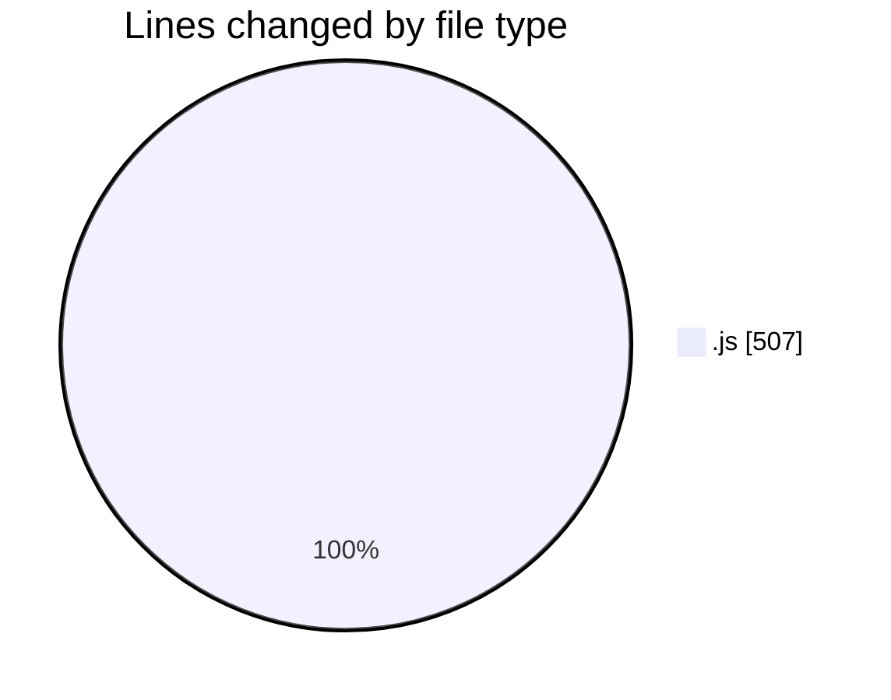
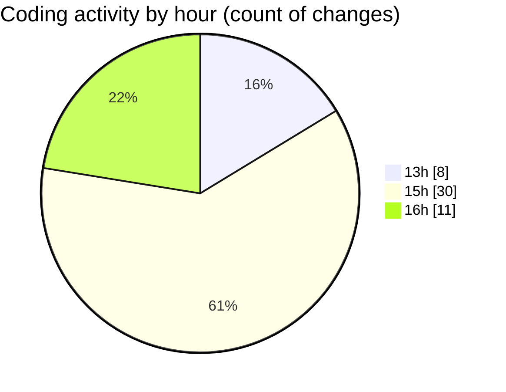

# nxtqube_webapp - Activity Summary 

## Overall Statistics

| Stat                   | Value                                                             |
| ---------------------- | ----------------------------------------------------------------- |
| **Lines Added** (➕)   | 393                                          |
| **Lines Removed** (➖) | 114                                        |
| **Net Change** (↕)    | 279                |
| **Active Time** (⌚)   | 50 minutes |

## Modified Files
- **dataGather.js** (+246, -111)
- **flightLog.modal.js** (+65, -2)
- **flightLog.controller.js** (+82, -1)

## Visualizations

### By File Type (Lines Changed)

### By Hour (Estimated Activity Count)

> **Last Updated:** 08/04/2025, 16:08:23