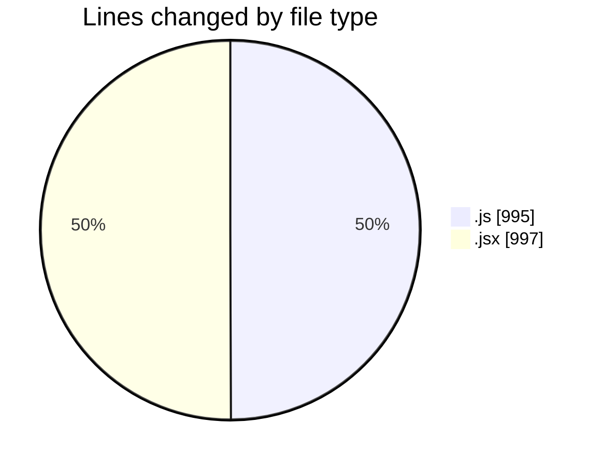
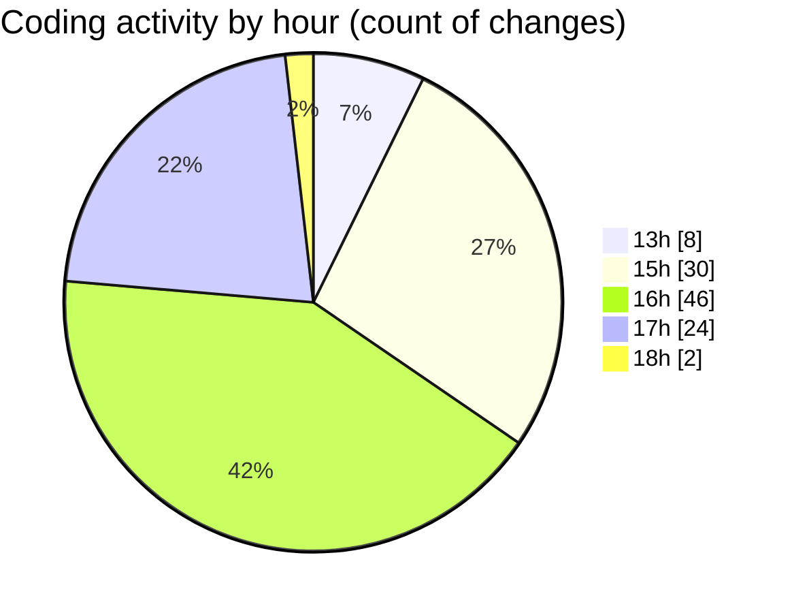

# nxtqube_webapp - Activity Summary 

## Overall Statistics

| Stat                   | Value                                                             |
| ---------------------- | ----------------------------------------------------------------- |
| **Lines Added** (➕)   | 1411                                          |
| **Lines Removed** (➖) | 581                                        |
| **Net Change** (↕)    | 830                |
| **Active Time** (⌚)   | 137 minutes |

## Modified Files
- **dataGather.js** (+507, -338)
- **flightLog.modal.js** (+65, -2)
- **flightLog.controller.js** (+82, -1)
- **LaunchControl.jsx** (+757, -240)

## Visualizations

### By File Type (Lines Changed)

### By Hour (Estimated Activity Count)

> **Last Updated:** 08/04/2025, 18:07:27