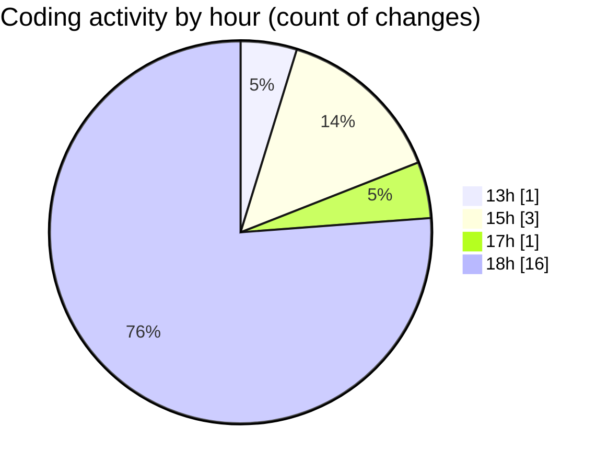

# nxtqube_webapp - Activity Summary 

## Overall Statistics

| Stat                   | Value                                                             |
| ---------------------- | ----------------------------------------------------------------- |
| **Lines Added** (➕)   | 1812                                          |
| **Lines Removed** (➖) | 1468                                        |
| **Net Change** (↕)    | 344                |
| **Active Time** (⌚)   | 24 minutes |

## Modified Files
- **dataGather.js** (+71, -0)
- **createMissionLogs.js** (+57, -0)
- **2_ARGOS_DATA.json** (+1552, -1468)
- **mqttSubscriber.js** (+132, -0)

## Visualizations

### By File Type (Lines Changed)

### By Hour (Estimated Activity Count)

> **Last Updated:** 09/04/2025, 18:28:12