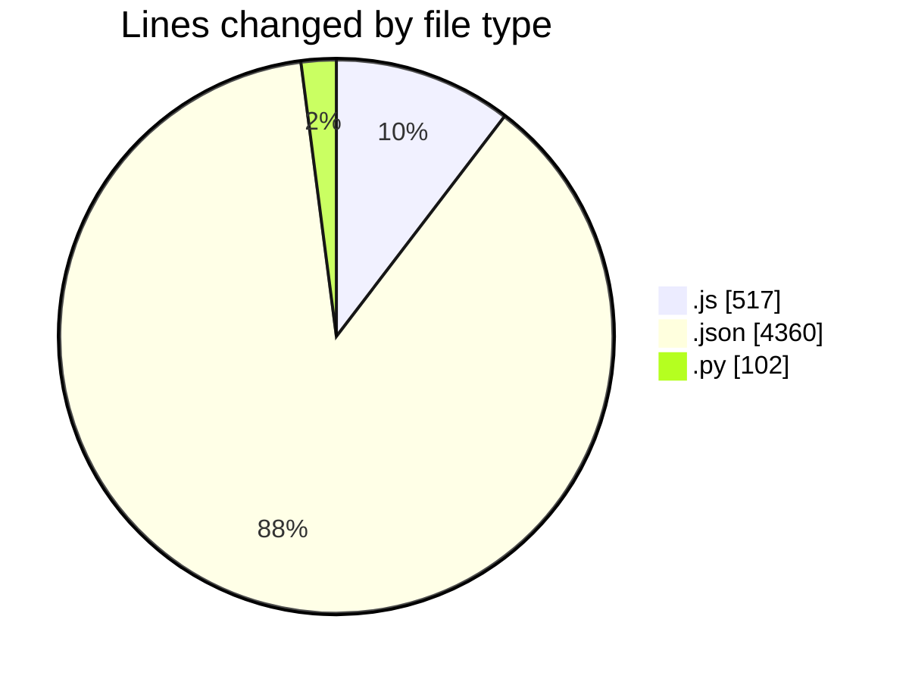
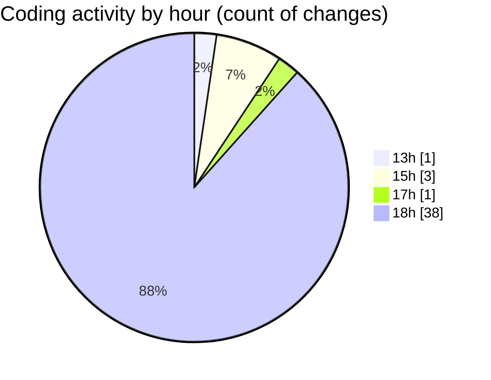

# nxtqube_webapp - Activity Summary 

## Overall Statistics

| Stat                   | Value                                                             |
| ---------------------- | ----------------------------------------------------------------- |
| **Lines Added** (➕)   | 2997                                          |
| **Lines Removed** (➖) | 1982                                        |
| **Net Change** (↕)    | 1015                |
| **Active Time** (⌚)   | 55 minutes |

## Modified Files
- **dataGather.js** (+71, -0)
- **createMissionLogs.js** (+57, -0)
- **2_ARGOS_DATA.json** (+2380, -1980)
- **mqttSubscriber.js** (+387, -2)
- **scriptLA.py** (+102, -0)

## Visualizations

### By File Type (Lines Changed)

### By Hour (Estimated Activity Count)

> **Last Updated:** 09/04/2025, 19:00:46