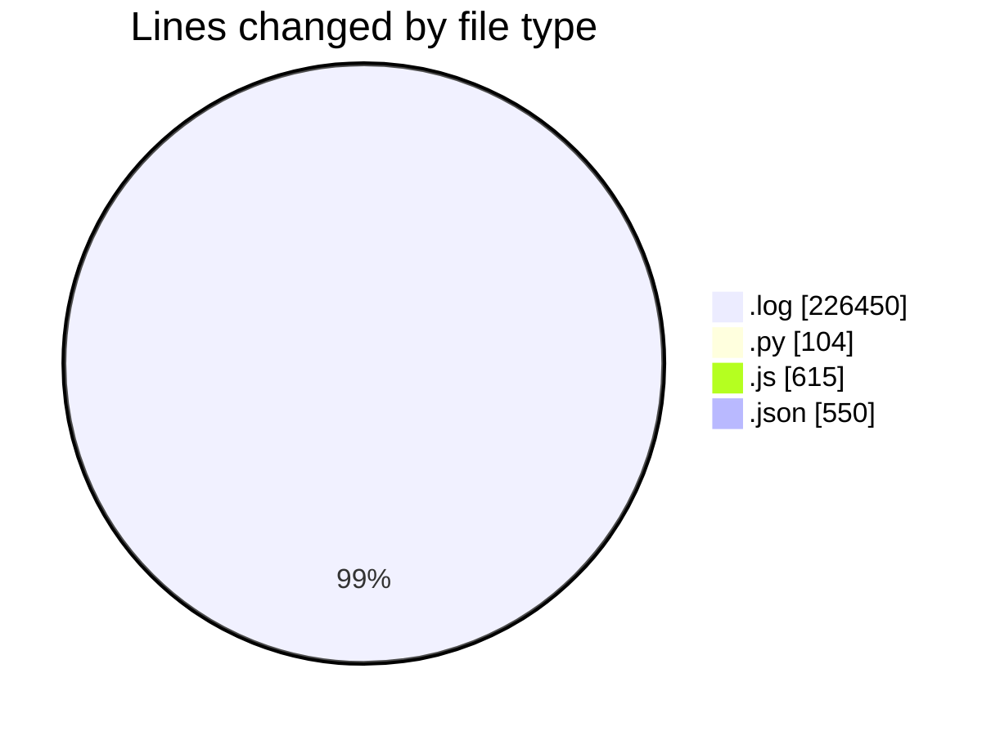
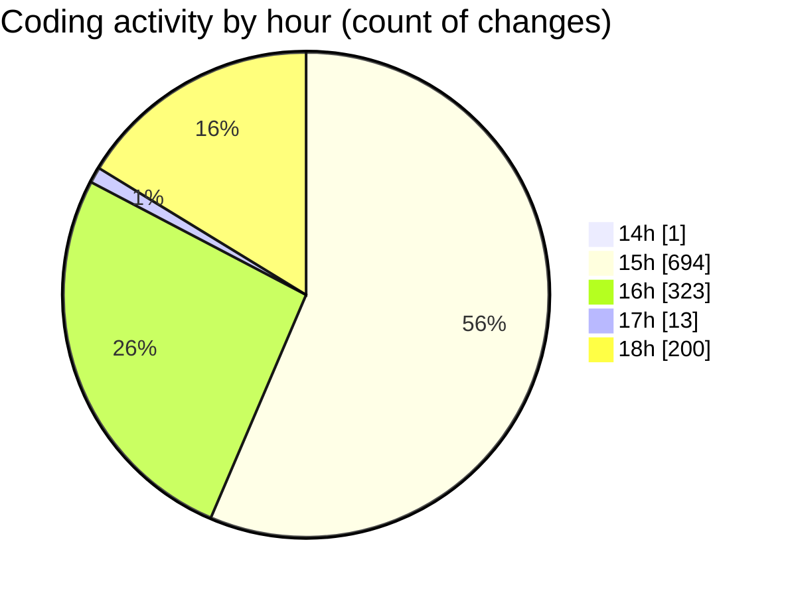

# nxtqube_webapp - Activity Summary 

## Overall Statistics

| Stat                   | Value                                                             |
| ---------------------- | ----------------------------------------------------------------- |
| **Lines Added** (➕)   | 118213                                          |
| **Lines Removed** (➖) | 109506                                        |
| **Net Change** (↕)    | 8707                |
| **Active Time** (⌚)   | 1232 minutes |

## Modified Files
- **2_ARGOS_DATA.log** (+117181, -109269)
- **scriptLA.py** (+103, -1)
- **createMissionLogs.js** (+380, -235)
- **enums.json** (+549, -1)

## Visualizations

### By File Type (Lines Changed)

### By Hour (Estimated Activity Count)

> **Last Updated:** 10/04/2025, 18:32:09