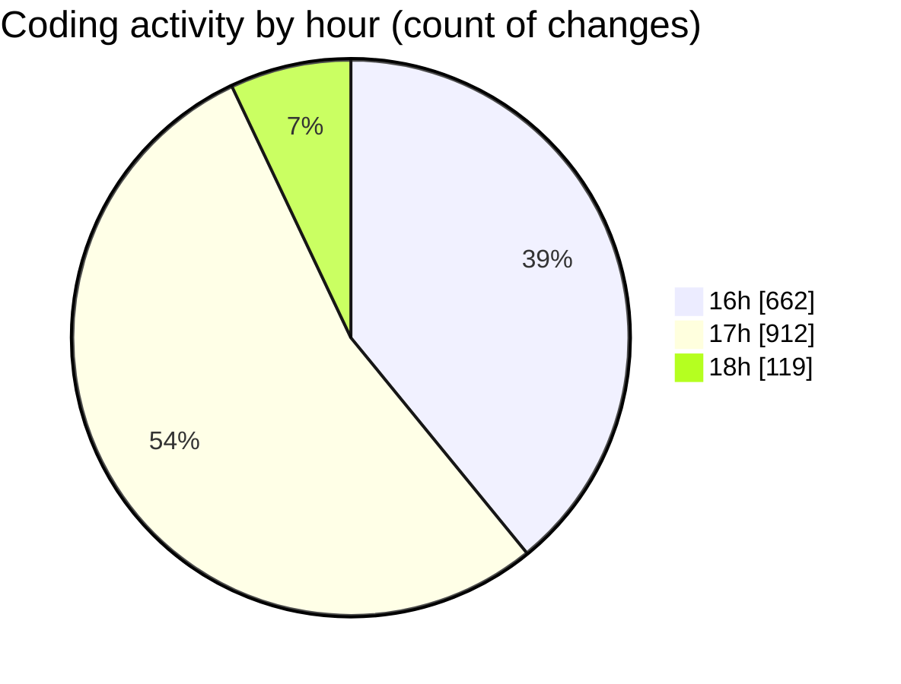

# nxtqube_webapp - Activity Summary 

## Overall Statistics

| Stat                   | Value                                                             |
| ---------------------- | ----------------------------------------------------------------- |
| **Lines Added** (➕)   | 67593                                          |
| **Lines Removed** (➖) | 66369                                        |
| **Net Change** (↕)    | 1224                |
| **Active Time** (⌚)   | 1698 minutes |

## Modified Files
- **scriptLA.py** (+102, -0)
- **2_ARGOS_DATA.log** (+66781, -66067)
- **mqttSubscriber.js** (+264, -143)
- **createMissionLogs.js** (+270, -147)
- **dataGather.js** (+76, -0)
- **flightLog.modal.js** (+100, -12)

## Visualizations

### By File Type (Lines Changed)

### By Hour (Estimated Activity Count)

> **Last Updated:** 11/04/2025, 18:36:43