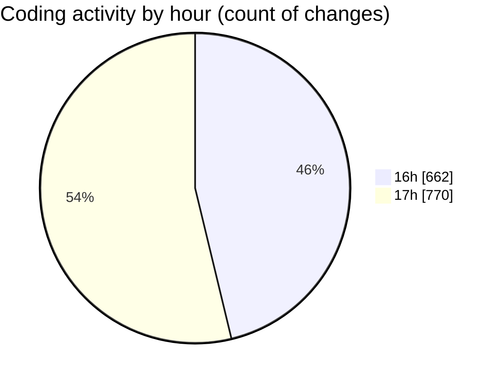

# nxtqube_webapp - Activity Summary 

## Overall Statistics

| Stat                   | Value                                                             |
| ---------------------- | ----------------------------------------------------------------- |
| **Lines Added** (➕)   | 56015                                          |
| **Lines Removed** (➖) | 15951                                        |
| **Net Change** (↕)    | 40064                |
| **Active Time** (⌚)   | 1436 minutes |

## Modified Files
- **scriptLA.py** (+102, -0)
- **2_ARGOS_DATA.log** (+55501, -15809)
- **mqttSubscriber.js** (+264, -140)
- **createMissionLogs.js** (+148, -2)

## Visualizations

### By File Type (Lines Changed)

### By Hour (Estimated Activity Count)

> **Last Updated:** 11/04/2025, 17:21:53