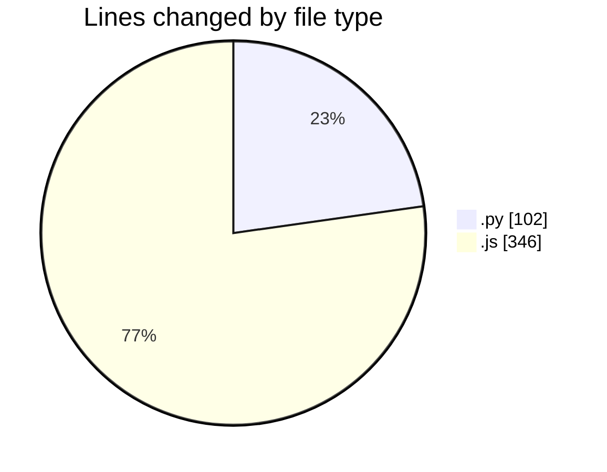
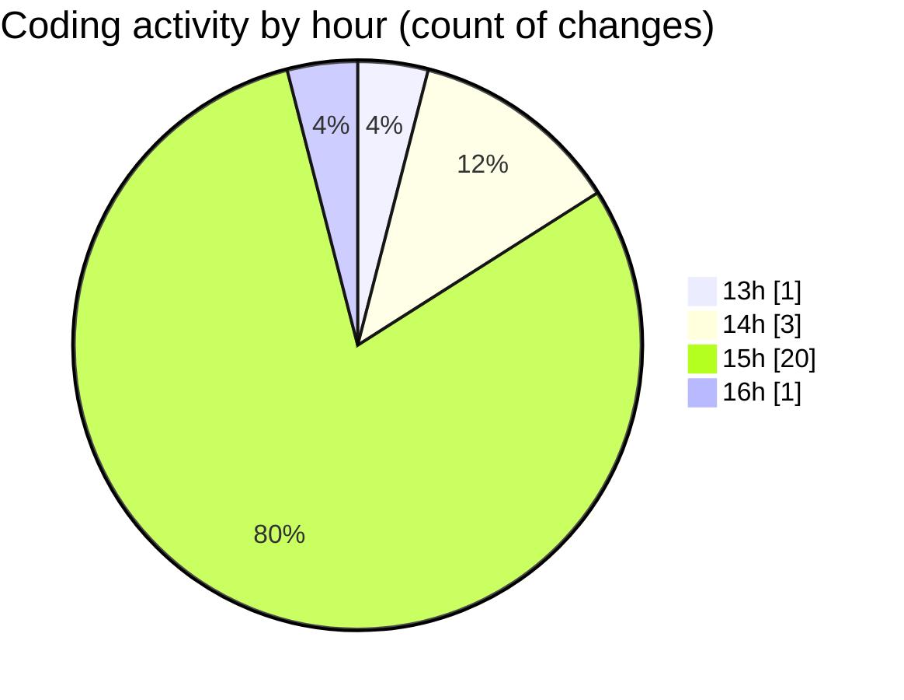

# nxtqube_webapp - Activity Summary 

## Overall Statistics

| Stat                   | Value                                                             |
| ---------------------- | ----------------------------------------------------------------- |
| **Lines Added** (➕)   | 433                                          |
| **Lines Removed** (➖) | 15                                        |
| **Net Change** (↕)    | 418                |
| **Active Time** (⌚)   | 30 minutes |

## Modified Files
- **scriptLA.py** (+102, -0)
- **createMissionLogs.js** (+331, -15)

## Visualizations

### By File Type (Lines Changed)

### By Hour (Estimated Activity Count)

> **Last Updated:** 12/04/2025, 16:38:43