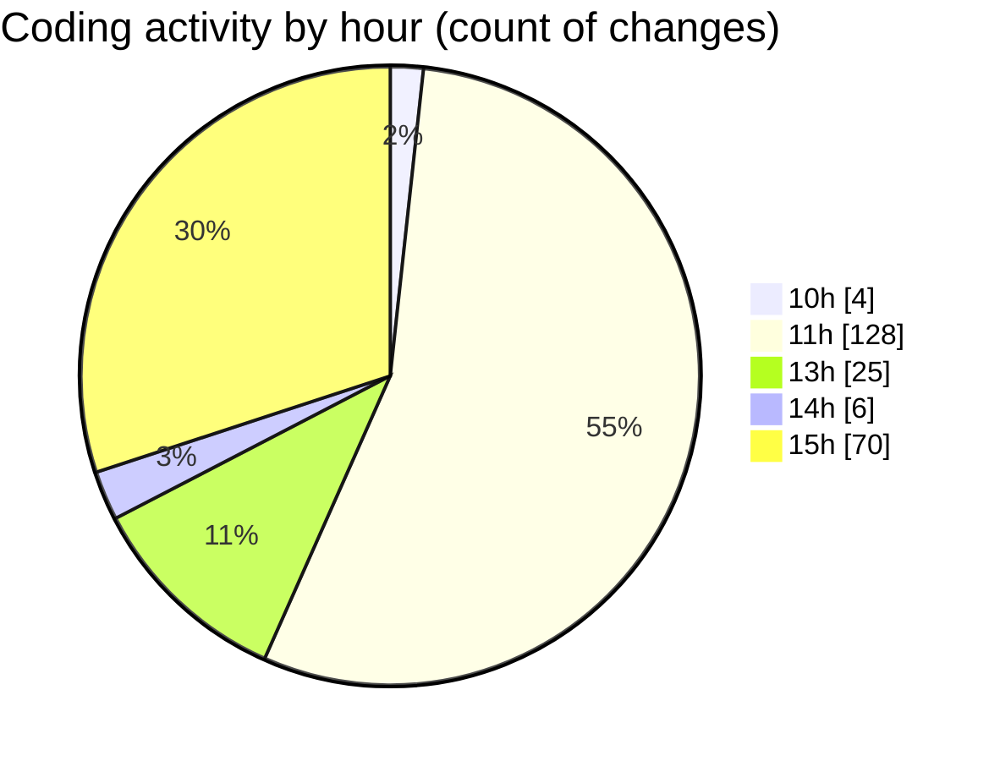

# nxtqube_webapp - Activity Summary 

## Overall Statistics

| Stat                   | Value                                                             |
| ---------------------- | ----------------------------------------------------------------- |
| **Lines Added** (➕)   | 8424                                          |
| **Lines Removed** (➖) | 7260                                        |
| **Net Change** (↕)    | 1164                |
| **Active Time** (⌚)   | 245 minutes |

## Modified Files
- **createMissionLogs.js** (+805, -413)
- **scriptLA.py** (+102, -0)
- **2_ARGOS_DATA.log** (+5576, -5492)
- **flightLog.modal.js** (+105, -6)
- **index.js** (+35, -0)
- **flightLog.controller.js** (+126, -9)
- **dataGather.js** (+75, -10)
- **2_ARGOS_DATA_2.log** (+1600, -1330)

## Visualizations

### By File Type (Lines Changed)

### By Hour (Estimated Activity Count)

> **Last Updated:** 14/04/2025, 16:01:05