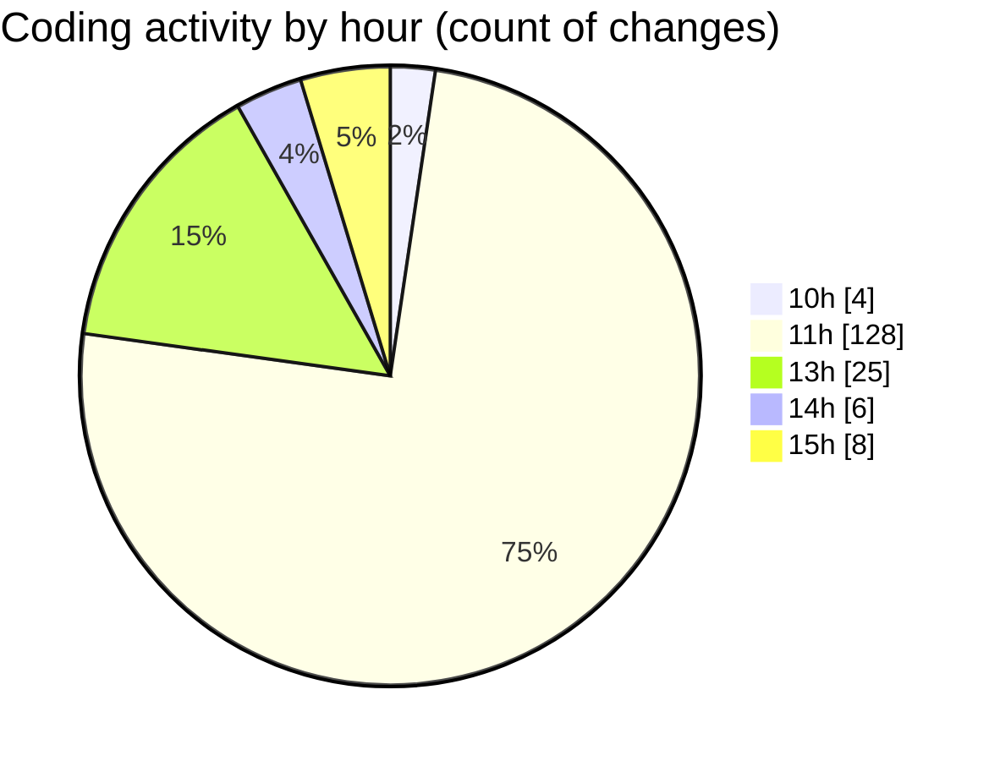

# nxtqube_webapp - Activity Summary 

## Overall Statistics

| Stat                   | Value                                                             |
| ---------------------- | ----------------------------------------------------------------- |
| **Lines Added** (➕)   | 6149                                          |
| **Lines Removed** (➖) | 5434                                        |
| **Net Change** (↕)    | 715                |
| **Active Time** (⌚)   | 184 minutes |

## Modified Files
- **createMissionLogs.js** (+639, -409)
- **scriptLA.py** (+102, -0)
- **2_ARGOS_DATA.log** (+5074, -5002)
- **flightLog.modal.js** (+105, -6)
- **index.js** (+35, -0)
- **flightLog.controller.js** (+119, -7)
- **dataGather.js** (+75, -10)

## Visualizations

### By File Type (Lines Changed)

### By Hour (Estimated Activity Count)

> **Last Updated:** 14/04/2025, 15:18:40