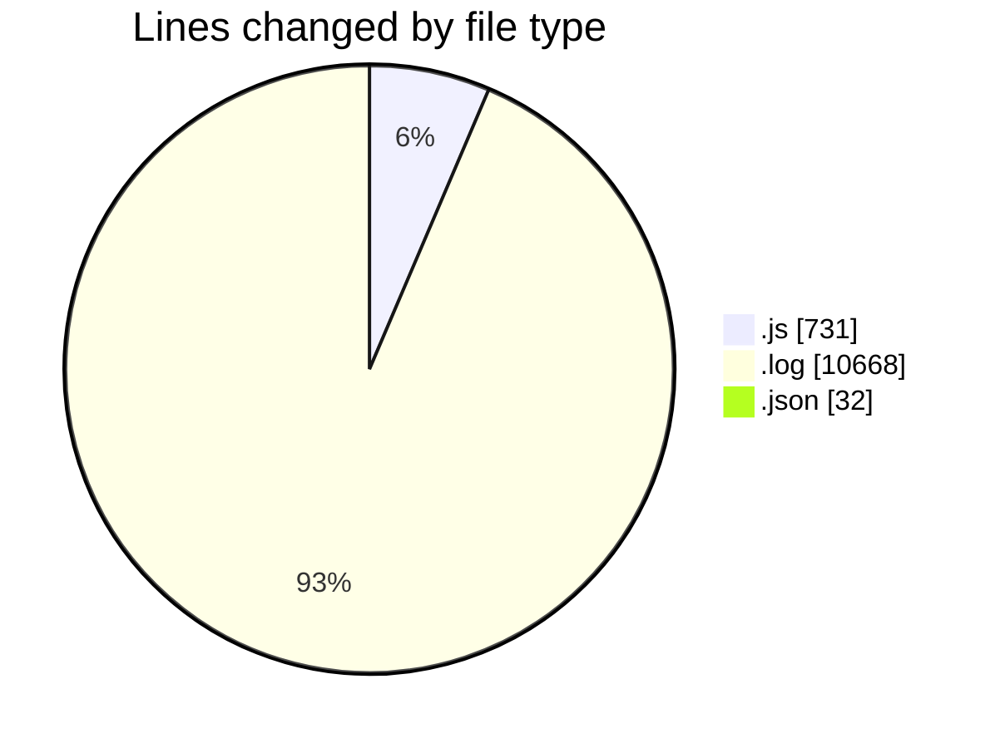
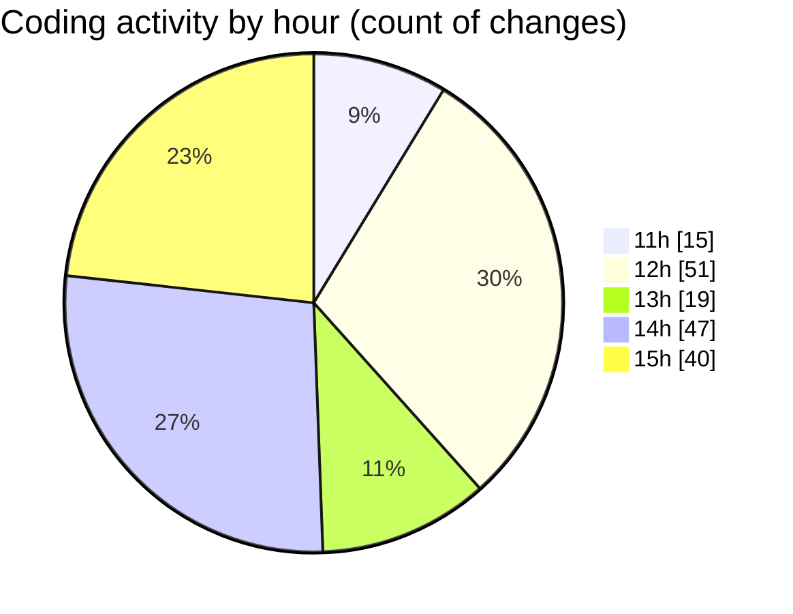

# nxtqube_webapp - Activity Summary 

## Overall Statistics

| Stat                   | Value                                                             |
| ---------------------- | ----------------------------------------------------------------- |
| **Lines Added** (➕)   | 10950                                          |
| **Lines Removed** (➖) | 481                                        |
| **Net Change** (↕)    | 10469                |
| **Active Time** (⌚)   | 176 minutes |

## Modified Files
- **createMissionLogs.js** (+250, -481)
- **2_ARGOS_DATA_9.log** (+866, -0)
- **2_ARGOS_DATA_11.log** (+1240, -0)
- **launchAutoMission.json** (+32, -0)
- **2_ARGOS_DATA_12.log** (+1426, -0)
- **2_ARGOS_DATA_14.log** (+254, -0)
- **2_ARGOS_DATA_15.log** (+1530, -0)
- **2_ARGOS_DATA_16.log** (+1788, -0)
- **2_ARGOS_DATA_17.log** (+1788, -0)
- **2_ARGOS_DATA_18.log** (+1776, -0)

## Visualizations

### By File Type (Lines Changed)

### By Hour (Estimated Activity Count)

> **Last Updated:** 15/04/2025, 15:18:48