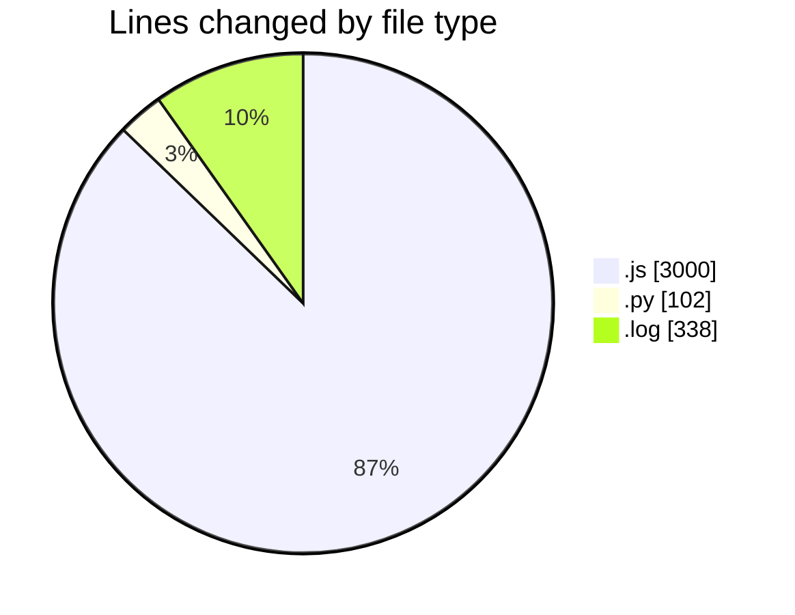

# nxtqube_webapp - Activity Summary 

## Overall Statistics

| Stat                   | Value                                                             |
| ---------------------- | ----------------------------------------------------------------- |
| **Lines Added** (➕)   | 2425                                          |
| **Lines Removed** (➖) | 1015                                        |
| **Net Change** (↕)    | 1410                |
| **Active Time** (⌚)   | 96 minutes |

## Modified Files
- **createMissionLogs.js** (+1832, -1000)
- **flightLog.controller.js** (+153, -15)
- **scriptLA.py** (+102, -0)
- **2_ARGOS_DATA_37.log** (+338, -0)

## Visualizations

### By File Type (Lines Changed)

### By Hour (Estimated Activity Count)

> **Last Updated:** 16/04/2025, 17:59:23