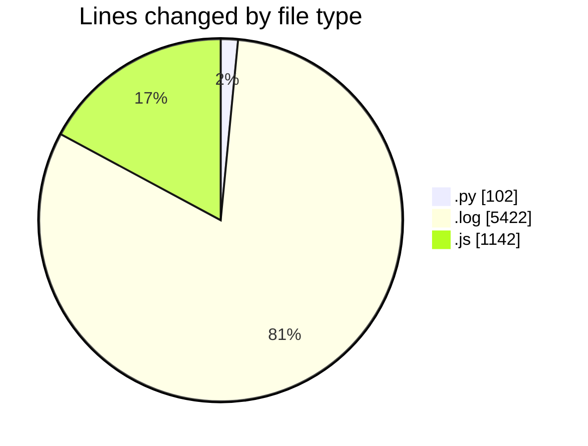
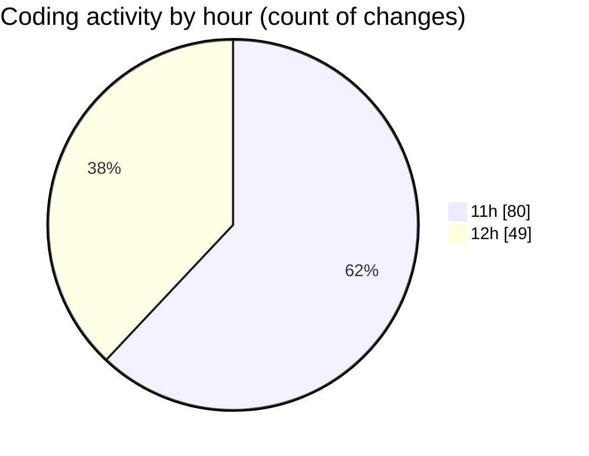

# nxtqube_webapp - Activity Summary 

## Overall Statistics

| Stat                   | Value                                                             |
| ---------------------- | ----------------------------------------------------------------- |
| **Lines Added** (➕)   | 6282                                          |
| **Lines Removed** (➖) | 384                                        |
| **Net Change** (↕)    | 5898                |
| **Active Time** (⌚)   | 132 minutes |

## Modified Files
- **scriptLA.py** (+102, -0)
- **2_ARGOS_DATA_70.log** (+1846, -0)
- **createMissionLogs.js** (+758, -384)
- **2_ARGOS_DATA_71.log** (+1788, -0)
- **2_ARGOS_DATA_73.log** (+1788, -0)

## Visualizations

### By File Type (Lines Changed)

### By Hour (Estimated Activity Count)

> **Last Updated:** 19/04/2025, 12:08:34