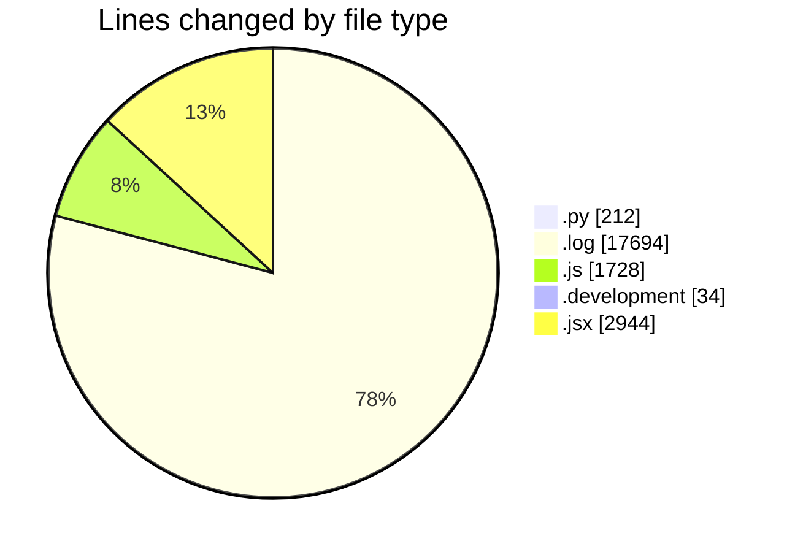
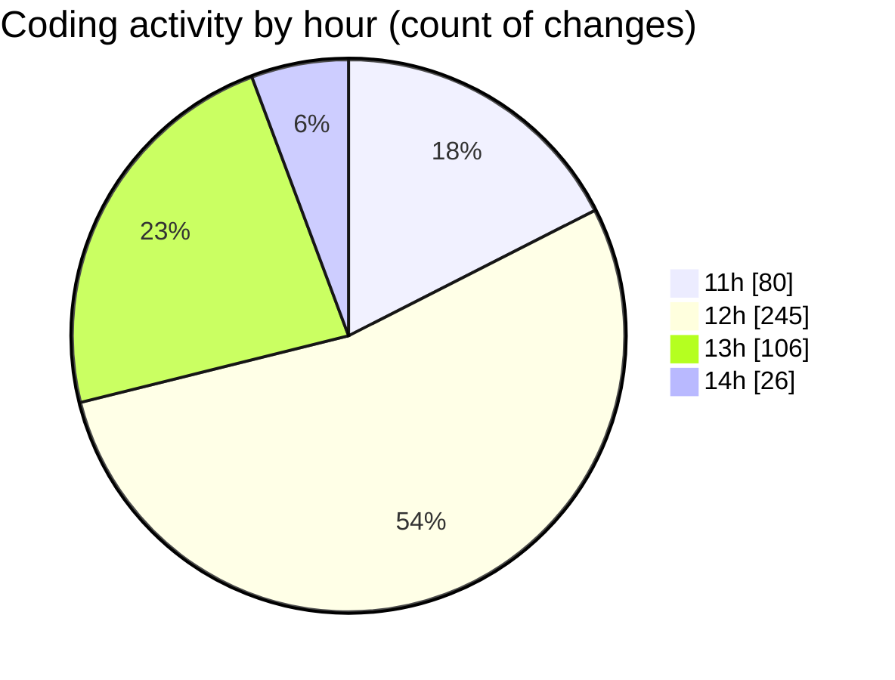

# nxtqube_webapp - Activity Summary 

## Overall Statistics

| Stat                   | Value                                                             |
| ---------------------- | ----------------------------------------------------------------- |
| **Lines Added** (➕)   | 21571                                          |
| **Lines Removed** (➖) | 1041                                        |
| **Net Change** (↕)    | 20530                |
| **Active Time** (⌚)   | 483 minutes |

## Modified Files
- **scriptLA.py** (+102, -0)
- **2_ARGOS_DATA_70.log** (+1846, -0)
- **createMissionLogs.js** (+977, -656)
- **2_ARGOS_DATA_71.log** (+1788, -0)
- **2_ARGOS_DATA_73.log** (+1788, -0)
- **2_ARGOS_DATA_74.log** (+1064, -0)
- **2_ARGOS_DATA_75.log** (+1846, -0)
- **2_ARGOS_DATA_76.log** (+376, -0)
- **2_ARGOS_DATA_78.log** (+1788, -0)
- **2_ARGOS_DATA_79.log** (+1788, -0)
- **2_ARGOS_DATA_80.log** (+1788, -0)
- **2_ARGOS_DATA_81.log** (+1788, -0)
- **2_ARGOS_DATA_82.log** (+1834, -0)
- **command.controller.js** (+31, -10)
- **droneCommand.controller.js** (+45, -9)
- **.env.development** (+29, -5)
- **script1.py** (+106, -4)
- **Map.jsx** (+1247, -23)
- **ExistingMission.jsx** (+830, -75)
- **EmergencySwitches.jsx** (+334, -128)
- **MissionControl.jsx** (+176, -131)

## Visualizations

### By File Type (Lines Changed)

### By Hour (Estimated Activity Count)

> **Last Updated:** 19/04/2025, 14:50:04