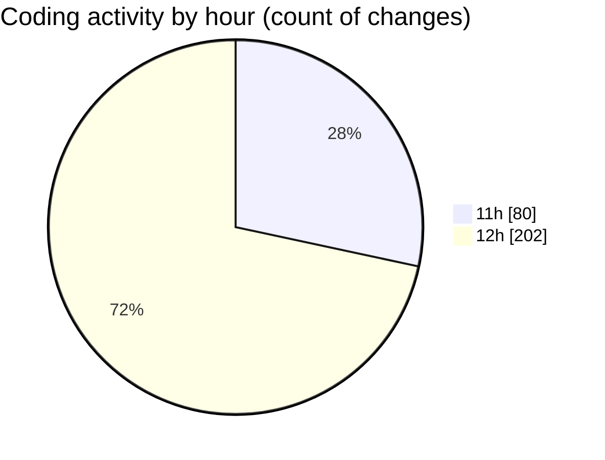

# nxtqube_webapp - Activity Summary 

## Overall Statistics

| Stat                   | Value                                                             |
| ---------------------- | ----------------------------------------------------------------- |
| **Lines Added** (➕)   | 13352                                          |
| **Lines Removed** (➖) | 385                                        |
| **Net Change** (↕)    | 12967                |
| **Active Time** (⌚)   | 292 minutes |

## Modified Files
- **scriptLA.py** (+102, -0)
- **2_ARGOS_DATA_70.log** (+1846, -0)
- **createMissionLogs.js** (+966, -385)
- **2_ARGOS_DATA_71.log** (+1788, -0)
- **2_ARGOS_DATA_73.log** (+1788, -0)
- **2_ARGOS_DATA_74.log** (+1064, -0)
- **2_ARGOS_DATA_75.log** (+1846, -0)
- **2_ARGOS_DATA_76.log** (+376, -0)
- **2_ARGOS_DATA_78.log** (+1788, -0)
- **2_ARGOS_DATA_79.log** (+1788, -0)

## Visualizations

### By File Type (Lines Changed)

### By Hour (Estimated Activity Count)

> **Last Updated:** 19/04/2025, 12:51:36