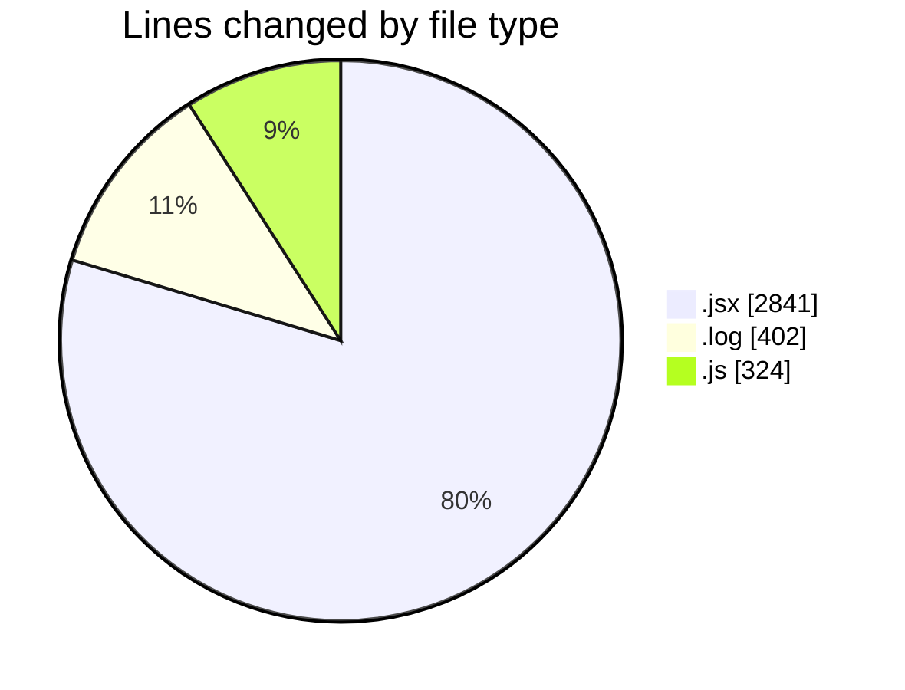
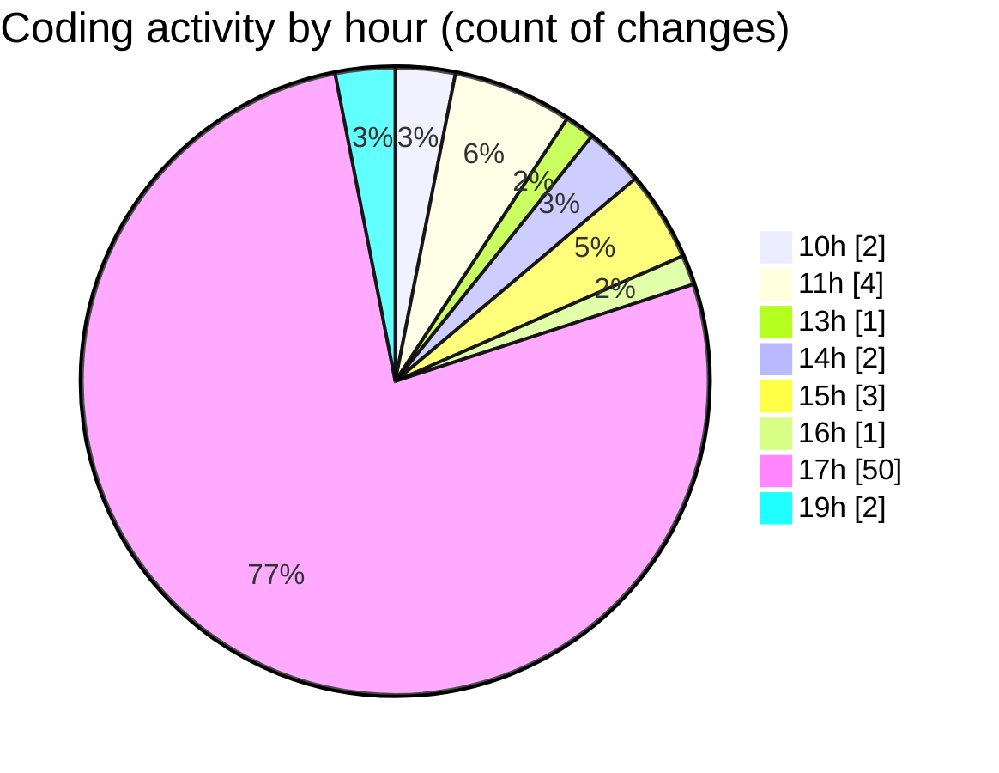

# nxtqube_webapp - Activity Summary 

## Overall Statistics

| Stat                   | Value                                                             |
| ---------------------- | ----------------------------------------------------------------- |
| **Lines Added** (➕)   | 3299                                          |
| **Lines Removed** (➖) | 268                                        |
| **Net Change** (↕)    | 3031                |
| **Active Time** (⌚)   | 64 minutes |

## Modified Files
- **LaunchControl.jsx** (+535, -1)
- **argos.log** (+201, -0)
- **argos.log** (+201, -0)
- **mqttSubscriber.js** (+122, -1)
- **DetailedLog.jsx** (+563, -73)
- **geofence.jsx** (+216, -0)
- **Map.jsx** (+1260, -193)
- **recenter.js** (+52, -0)
- **polygonFence.js** (+149, -0)

## Visualizations

### By File Type (Lines Changed)

### By Hour (Estimated Activity Count)

> **Last Updated:** 02/05/2025, 19:02:26