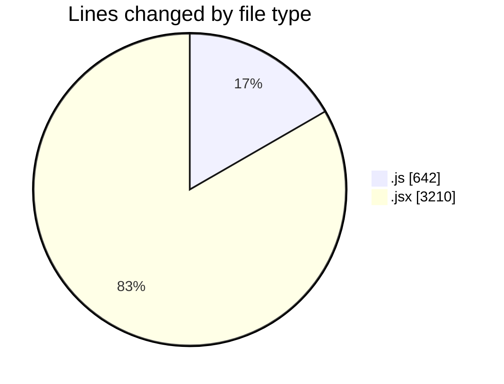
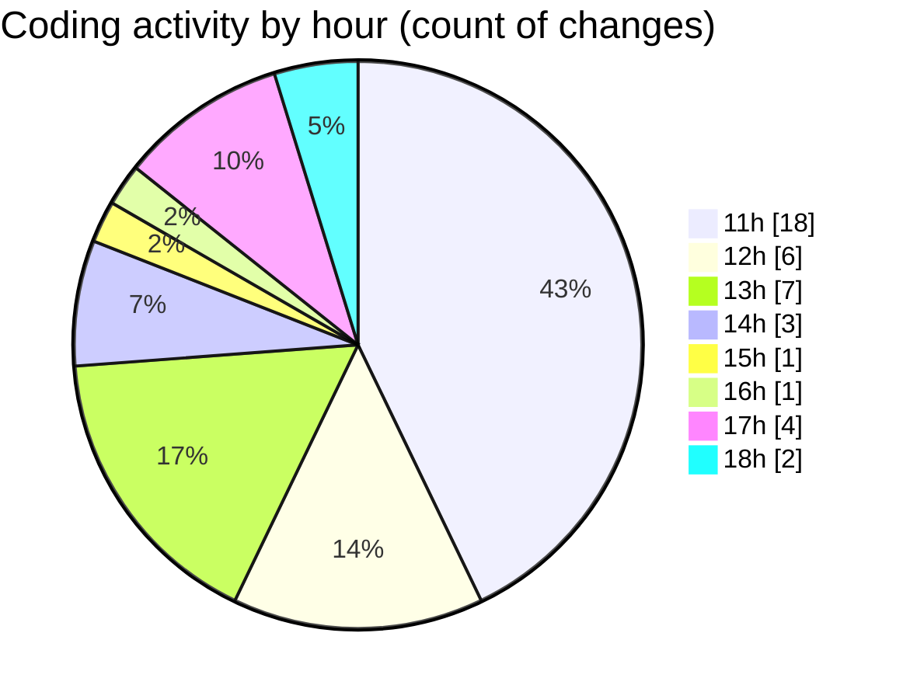

# nxtqube_webapp - Activity Summary 

## Overall Statistics

| Stat                   | Value                                                             |
| ---------------------- | ----------------------------------------------------------------- |
| **Lines Added** (➕)   | 3692                                          |
| **Lines Removed** (➖) | 160                                        |
| **Net Change** (↕)    | 3532                |
| **Active Time** (⌚)   | 38 minutes |

## Modified Files
- **recenter.js** (+84, -5)
- **ExistingFenceForm.jsx** (+347, -1)
- **Map.jsx** (+1070, -45)
- **CreateFenceForm.jsx** (+911, -17)
- **ExistingMission.jsx** (+791, -28)
- **drawMission.js** (+489, -64)

## Visualizations

### By File Type (Lines Changed)

### By Hour (Estimated Activity Count)

> **Last Updated:** 03/05/2025, 18:27:48