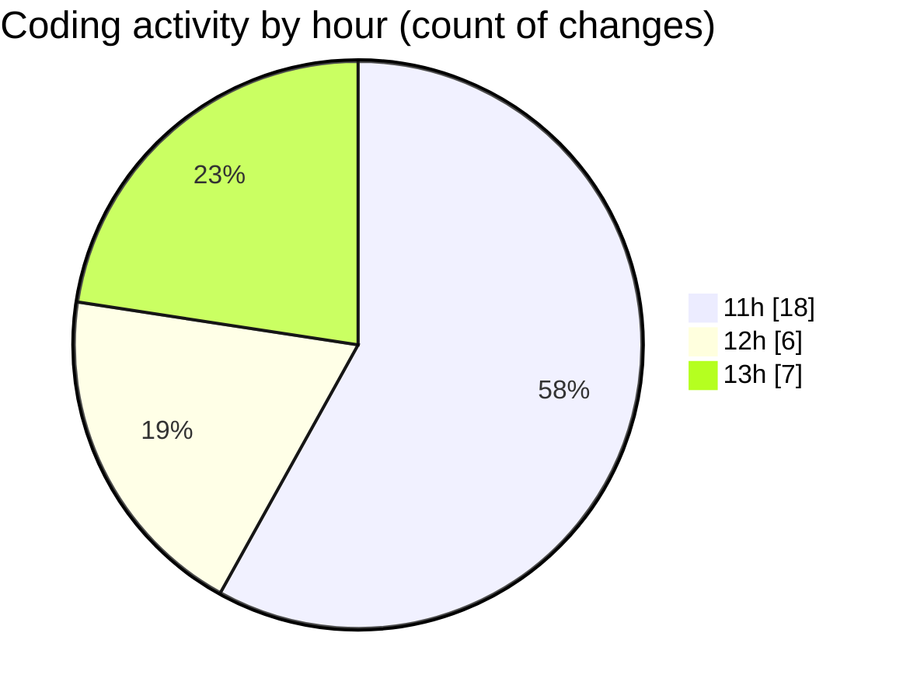

# nxtqube_webapp - Activity Summary 

## Overall Statistics

| Stat                   | Value                                                             |
| ---------------------- | ----------------------------------------------------------------- |
| **Lines Added** (➕)   | 2409                                          |
| **Lines Removed** (➖) | 23                                        |
| **Net Change** (↕)    | 2386                |
| **Active Time** (⌚)   | 31 minutes |

## Modified Files
- **recenter.js** (+84, -5)
- **ExistingFenceForm.jsx** (+347, -1)
- **Map.jsx** (+1067, -0)
- **CreateFenceForm.jsx** (+911, -17)

## Visualizations

### By File Type (Lines Changed)

### By Hour (Estimated Activity Count)

> **Last Updated:** 03/05/2025, 13:09:26