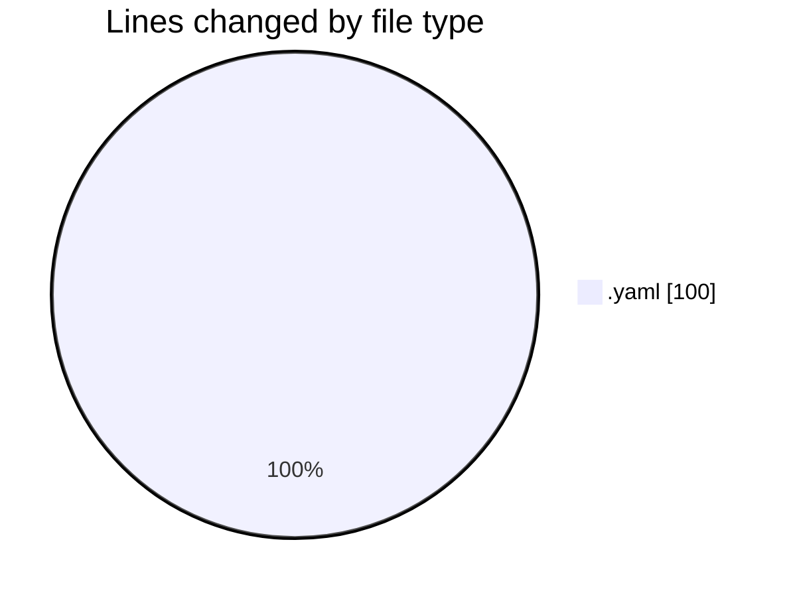
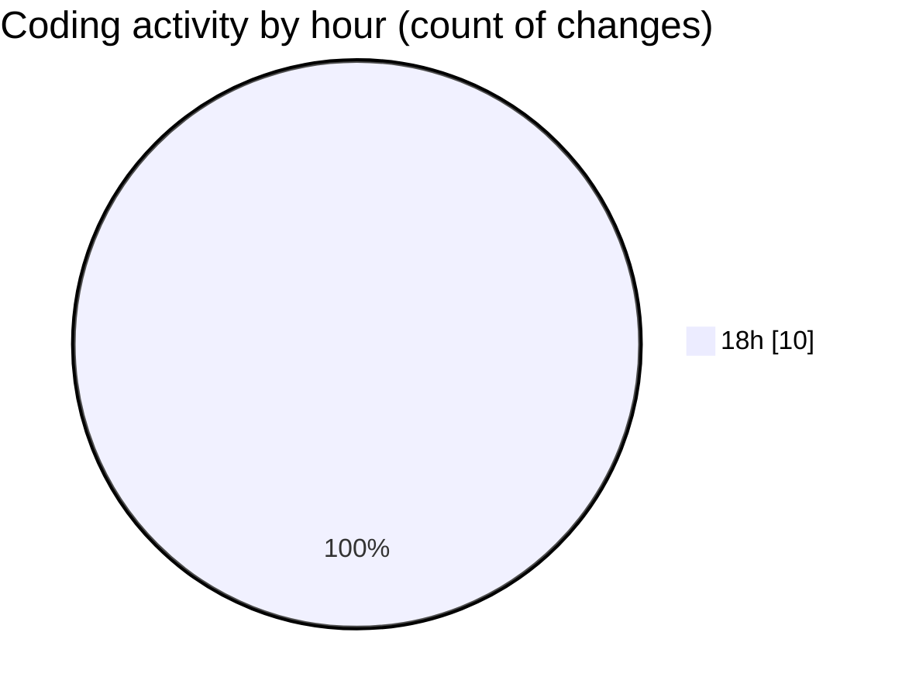

# argos_orchestrator - Activity Summary 

## Overall Statistics

| Stat                   | Value                                                             |
| ---------------------- | ----------------------------------------------------------------- |
| **Lines Added** (➕)   | 85                                          |
| **Lines Removed** (➖) | 15                                        |
| **Net Change** (↕)    | 70                |
| **Active Time** (⌚)   | 10 minutes |

## Modified Files
- **drone.yaml** (+36, -0)
- **dock.yaml** (+9, -0)
- **mqttgateway.yaml** (+36, -15)
- **mavproxy_bridge.yaml** (+4, -0)

## Visualizations

### By File Type (Lines Changed)

### By Hour (Estimated Activity Count)

> **Last Updated:** 08/05/2025, 18:51:51