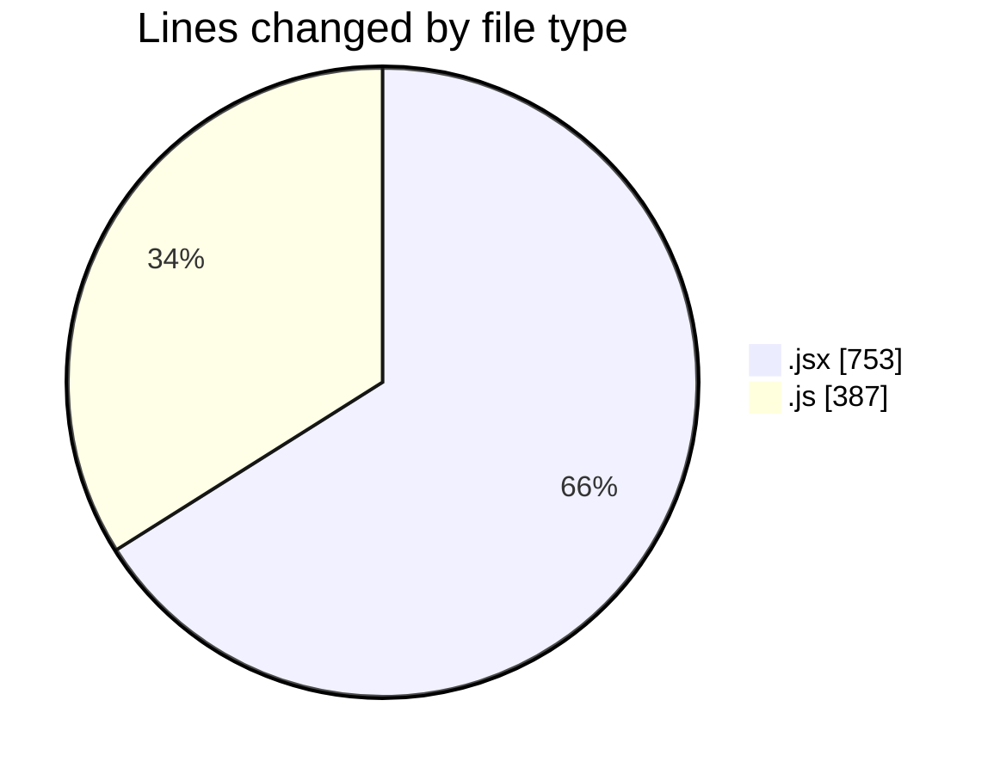
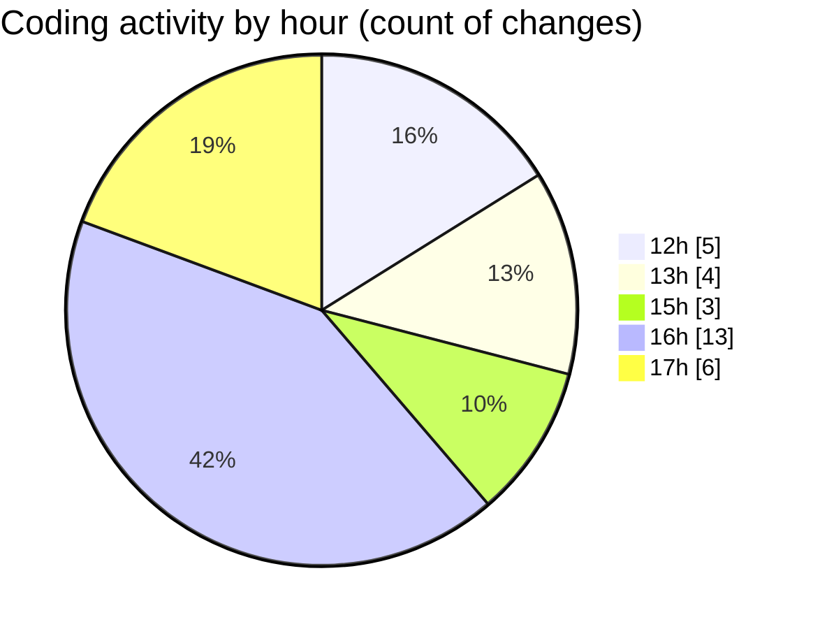

# Argos-dev - Activity Summary 

## Overall Statistics

| Stat                   | Value                                                             |
| ---------------------- | ----------------------------------------------------------------- |
| **Lines Added** (➕)   | 1116                                          |
| **Lines Removed** (➖) | 24                                        |
| **Net Change** (↕)    | 1092                |
| **Active Time** (⌚)   | 38 minutes |

## Modified Files
- **ExistingFenceForm.jsx** (+425, -6)
- **geofence.jsx** (+308, -14)
- **fenceData.controller.js** (+360, -0)
- **fenceData.route.js** (+23, -4)

## Visualizations

### By File Type (Lines Changed)

### By Hour (Estimated Activity Count)

> **Last Updated:** 09/05/2025, 17:05:57