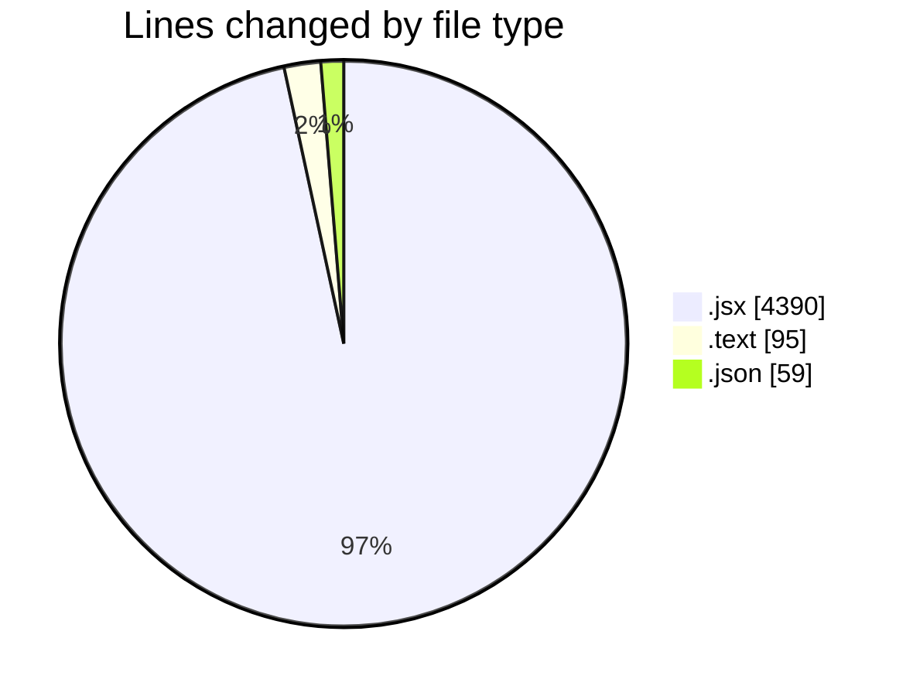
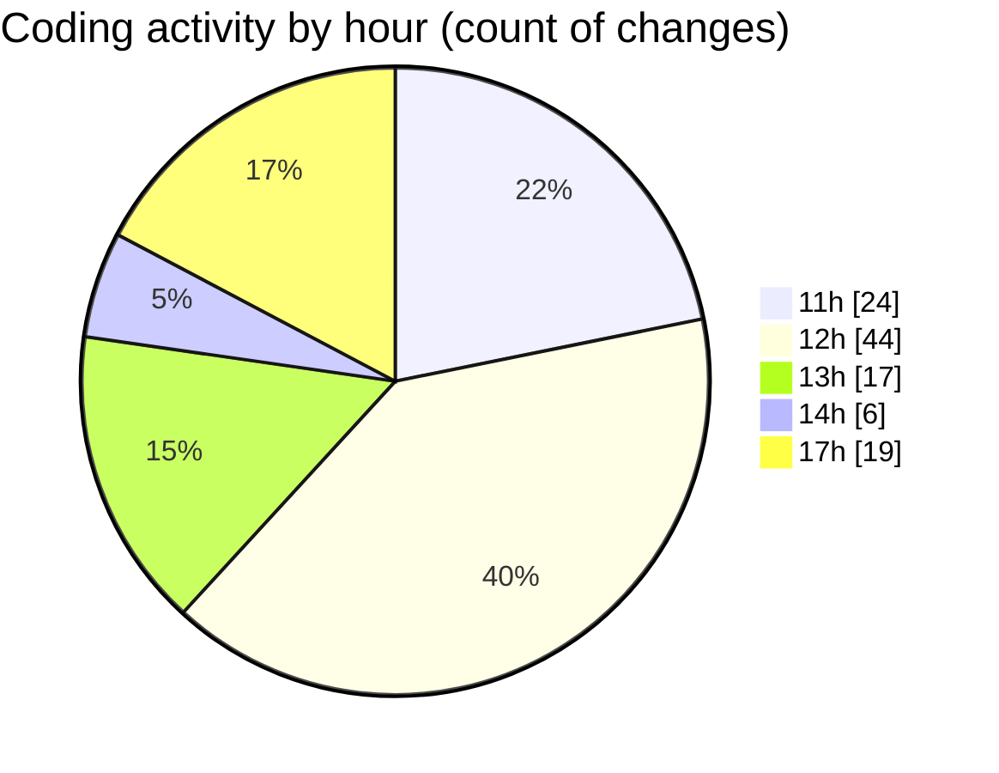

# Argos-dev - Activity Summary 

## Overall Statistics

| Stat                   | Value                                                             |
| ---------------------- | ----------------------------------------------------------------- |
| **Lines Added** (➕)   | 3685                                          |
| **Lines Removed** (➖) | 859                                        |
| **Net Change** (↕)    | 2826                |
| **Active Time** (⌚)   | 129 minutes |

## Modified Files
- **Create.jsx** (+459, -11)
- **Setting.jsx** (+1125, -840)
- **Map.jsx** (+1585, -3)
- **text.text** (+95, -0)
- **package.json** (+59, -0)
- **SettingsSidebar.jsx** (+103, -0)
- **SettingsContent.jsx** (+132, -5)
- **General.jsx** (+127, -0)

## Visualizations

### By File Type (Lines Changed)

### By Hour (Estimated Activity Count)

> **Last Updated:** 10/05/2025, 17:46:47