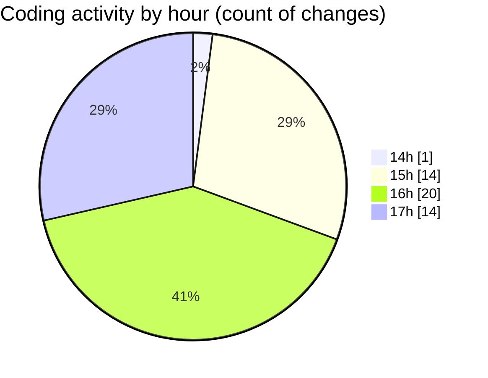

# Argos-dev - Activity Summary 

## Overall Statistics

| Stat                   | Value                                                             |
| ---------------------- | ----------------------------------------------------------------- |
| **Lines Added** (➕)   | 2514                                          |
| **Lines Removed** (➖) | 376                                        |
| **Net Change** (↕)    | 2138                |
| **Active Time** (⌚)   | 66 minutes |

## Modified Files
- **UserAndPermissions.jsx** (+608, -352)
- **SettingsContent.jsx** (+70, -2)
- **ExistingMission.jsx** (+791, -0)
- **General.jsx** (+116, -0)
- **DroneControl.jsx** (+632, -0)
- **DockControl.jsx** (+277, -22)
- **DataManagement.jsx** (+20, -0)

## Visualizations

### By File Type (Lines Changed)

### By Hour (Estimated Activity Count)

> **Last Updated:** 12/05/2025, 17:39:24