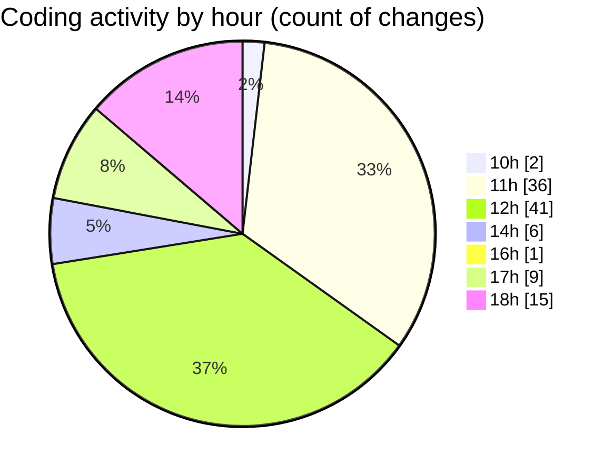

# Argos-dev - Activity Summary 

## Overall Statistics

| Stat                   | Value                                                             |
| ---------------------- | ----------------------------------------------------------------- |
| **Lines Added** (➕)   | 3798                                          |
| **Lines Removed** (➖) | 1267                                        |
| **Net Change** (↕)    | 2531                |
| **Active Time** (⌚)   | 136 minutes |

## Modified Files
- **General.jsx** (+516, -413)
- **SettingsContent.jsx** (+70, -1)
- **GeneralCostomizedPrechecks.jsx** (+668, -369)
- **GeneralSettings.jsx** (+386, -5)
- **DockControl.jsx** (+815, -367)
- **Create.jsx** (+448, -112)
- **MissionControl.jsx** (+895, -0)

## Visualizations

### By File Type (Lines Changed)

### By Hour (Estimated Activity Count)

> **Last Updated:** 13/05/2025, 18:47:47