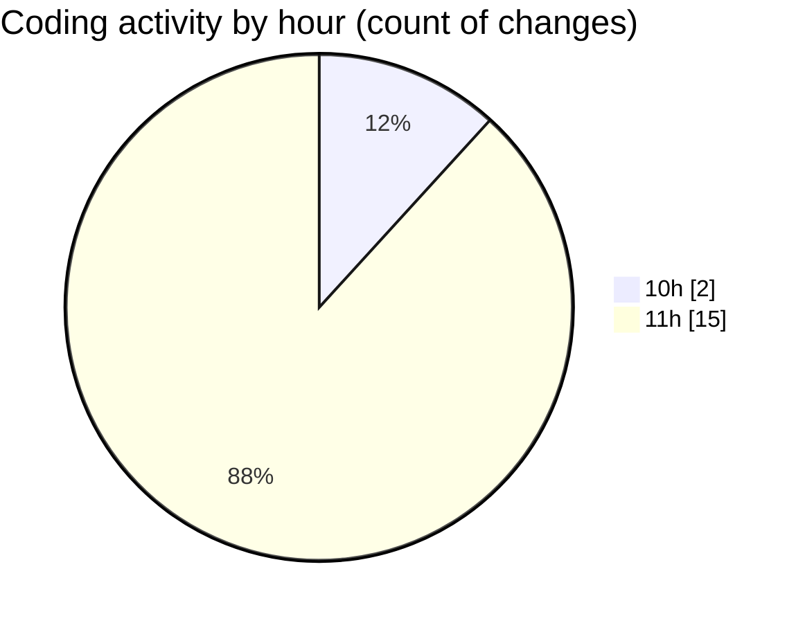

# Argos-dev - Activity Summary 

## Overall Statistics

| Stat                   | Value                                                             |
| ---------------------- | ----------------------------------------------------------------- |
| **Lines Added** (➕)   | 1572                                          |
| **Lines Removed** (➖) | 380                                        |
| **Net Change** (↕)    | 1192                |
| **Active Time** (⌚)   | 15 minutes |

## Modified Files
- **DockControl.jsx** (+482, -0)
- **DataManagement.jsx** (+120, -0)
- **SettingsContent.jsx** (+73, -0)
- **help.jsx** (+761, -380)
- **SettingsSidebar.jsx** (+136, -0)

## Visualizations

### By File Type (Lines Changed)

### By Hour (Estimated Activity Count)

> **Last Updated:** 14/05/2025, 11:54:04