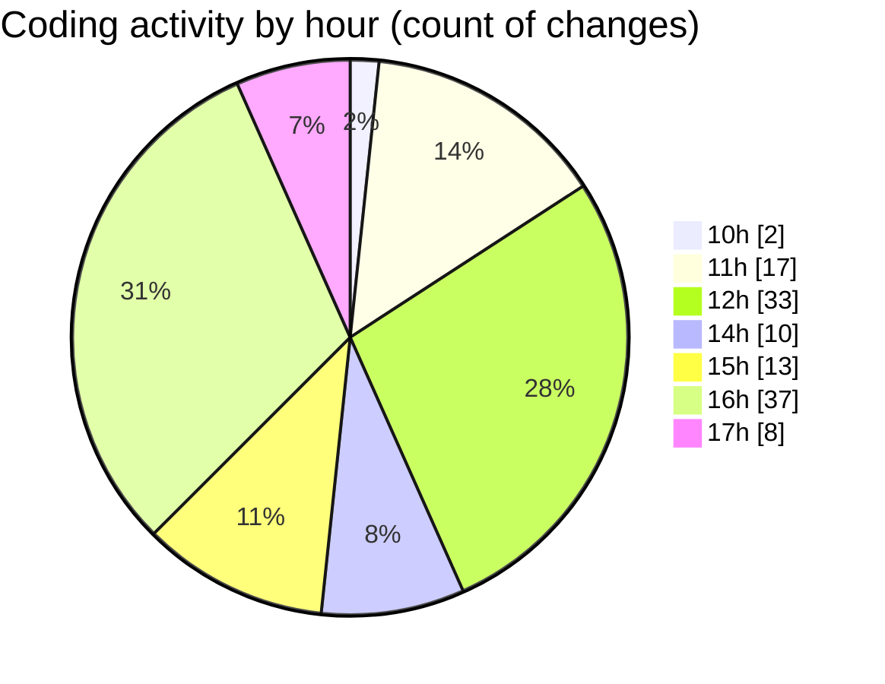

# Argos-dev - Activity Summary 

## Overall Statistics

| Stat                   | Value                                                             |
| ---------------------- | ----------------------------------------------------------------- |
| **Lines Added** (➕)   | 4368                                          |
| **Lines Removed** (➖) | 1892                                        |
| **Net Change** (↕)    | 2476                |
| **Active Time** (⌚)   | 147 minutes |

## Modified Files
- **DockControl.jsx** (+485, -2)
- **DataManagement.jsx** (+1098, -752)
- **SettingsContent.jsx** (+83, -8)
- **help.jsx** (+967, -586)
- **SettingsSidebar.jsx** (+153, -2)
- **General.jsx** (+163, -111)
- **GeneralSettings.jsx** (+685, -330)
- **DroneControl.jsx** (+734, -101)

## Visualizations

### By File Type (Lines Changed)

### By Hour (Estimated Activity Count)

> **Last Updated:** 14/05/2025, 17:03:47