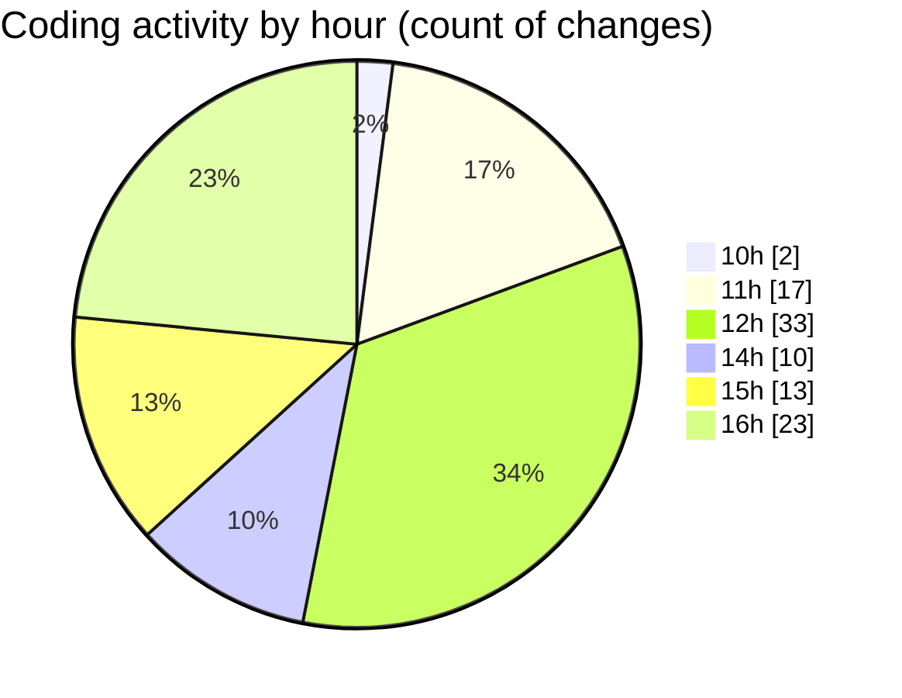

# Argos-dev - Activity Summary 

## Overall Statistics

| Stat                   | Value                                                             |
| ---------------------- | ----------------------------------------------------------------- |
| **Lines Added** (➕)   | 3681                                          |
| **Lines Removed** (➖) | 1426                                        |
| **Net Change** (↕)    | 2255                |
| **Active Time** (⌚)   | 120 minutes |

## Modified Files
- **DockControl.jsx** (+484, -2)
- **DataManagement.jsx** (+872, -752)
- **SettingsContent.jsx** (+83, -5)
- **help.jsx** (+864, -586)
- **SettingsSidebar.jsx** (+153, -1)
- **General.jsx** (+107, -55)
- **GeneralSettings.jsx** (+384, -25)
- **DroneControl.jsx** (+734, -0)

## Visualizations

### By File Type (Lines Changed)

### By Hour (Estimated Activity Count)

> **Last Updated:** 14/05/2025, 16:53:47