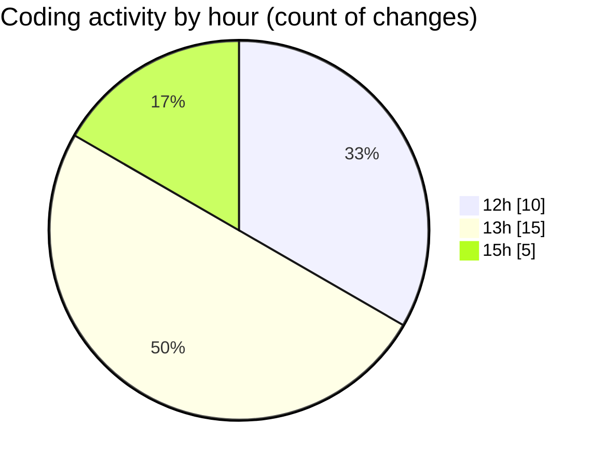

# Argos-dev - Activity Summary 

## Overall Statistics

| Stat                   | Value                                                             |
| ---------------------- | ----------------------------------------------------------------- |
| **Lines Added** (➕)   | 1930                                          |
| **Lines Removed** (➖) | 16                                        |
| **Net Change** (↕)    | 1914                |
| **Active Time** (⌚)   | 41 minutes |

## Modified Files
- **FetchHomeLocation.jsx** (+371, -10)
- **setSafeLocation.jsx** (+397, -6)
- **DockControl.jsx** (+284, -0)
- **Sidenav.jsx** (+552, -0)
- **createMissionLogs.js** (+326, -0)

## Visualizations

### By File Type (Lines Changed)

### By Hour (Estimated Activity Count)

> **Last Updated:** 15/05/2025, 15:38:10