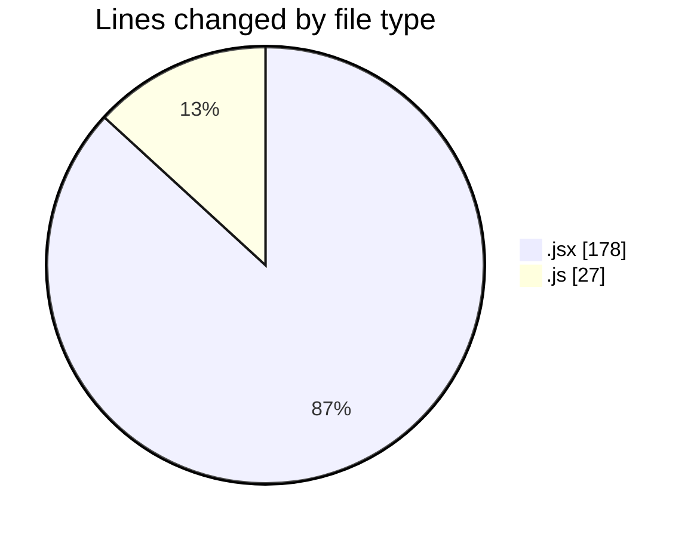
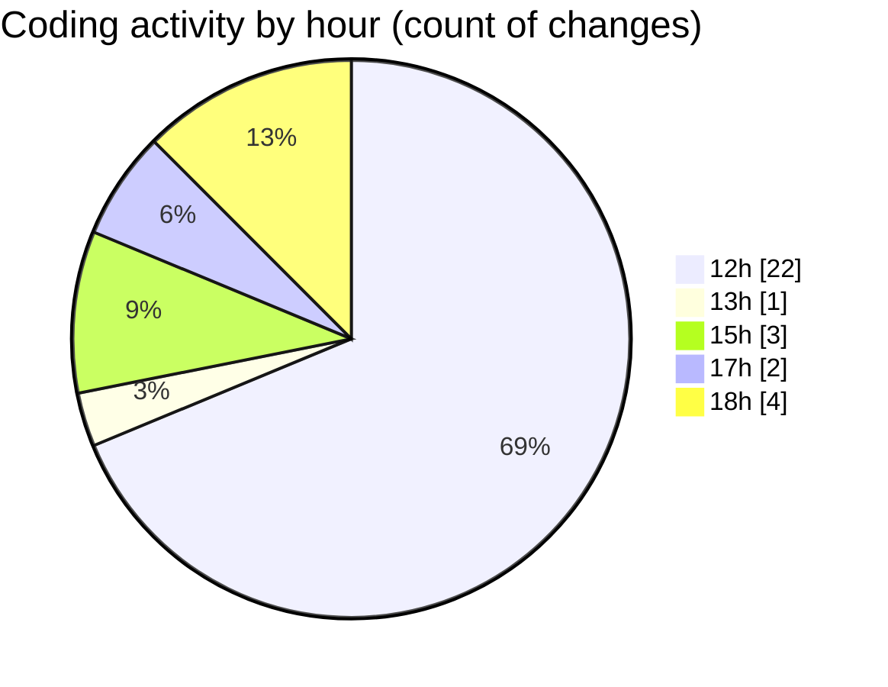

# Argos-dev - Activity Summary 

## Overall Statistics

| Stat                   | Value                                                             |
| ---------------------- | ----------------------------------------------------------------- |
| **Lines Added** (➕)   | 152                                          |
| **Lines Removed** (➖) | 53                                        |
| **Net Change** (↕)    | 99                |
| **Active Time** (⌚)   | 35 minutes |

## Modified Files
- **DockControl.jsx** (+127, -51)
- **safeLocation.modal.js** (+25, -2)

## Visualizations

### By File Type (Lines Changed)

### By Hour (Estimated Activity Count)

> **Last Updated:** 16/05/2025, 18:04:23