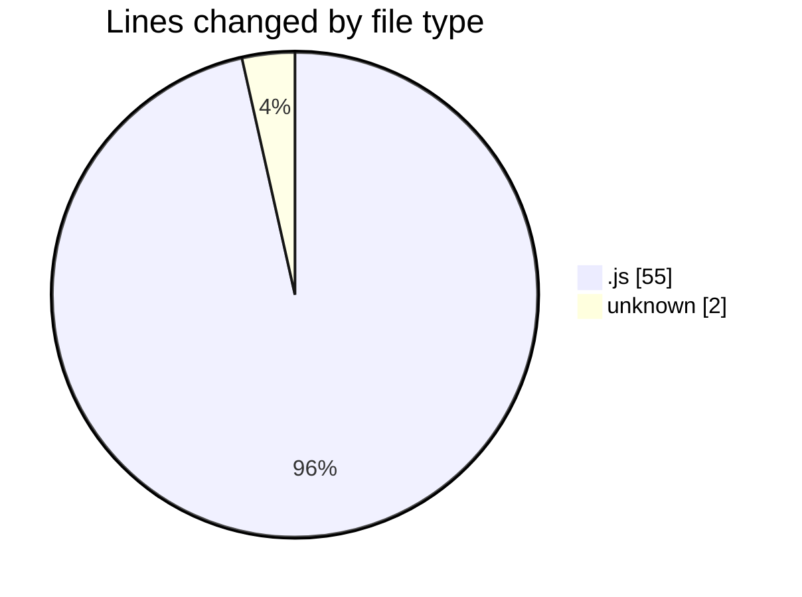
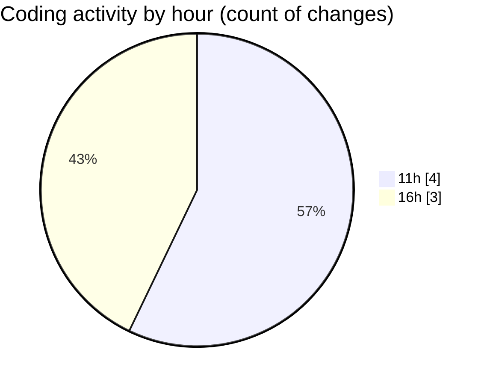

# javacript - Activity Summary 

## Overall Statistics

| Stat                   | Value                                                             |
| ---------------------- | ----------------------------------------------------------------- |
| **Lines Added** (➕)   | 55                                          |
| **Lines Removed** (➖) | 2                                        |
| **Net Change** (↕)    | 53                |
| **Active Time** (⌚)   | 6 minutes |

## Modified Files
- **test.js** (+53, -2)
- **.env** (+2, -0)

## Visualizations

### By File Type (Lines Changed)

### By Hour (Estimated Activity Count)

> **Last Updated:** 17/05/2025, 16:31:32