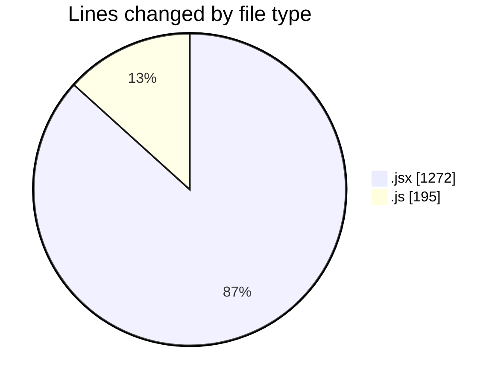
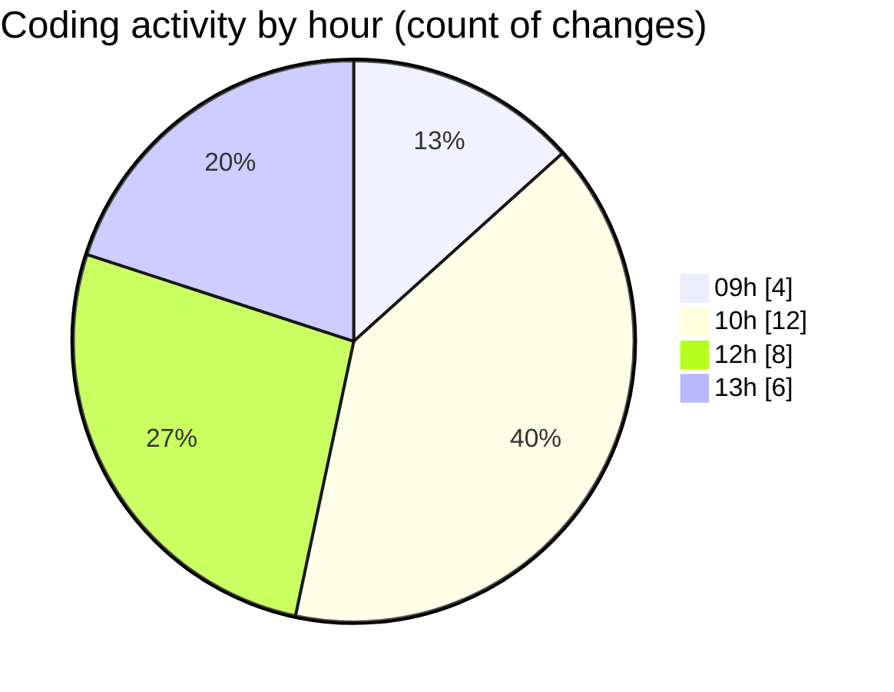

# nxtqube_webapp - Activity Summary 

## Overall Statistics

| Stat                   | Value                                                             |
| ---------------------- | ----------------------------------------------------------------- |
| **Lines Added** (➕)   | 1254                                          |
| **Lines Removed** (➖) | 213                                        |
| **Net Change** (↕)    | 1041                |
| **Active Time** (⌚)   | 35 minutes |

## Modified Files
- **geofence.jsx** (+314, -1)
- **DockControl.jsx** (+385, -47)
- **FetchHomeLocation.jsx** (+368, -157)
- **dockLocation.js** (+48, -0)
- **dockLocation.controller.js** (+76, -8)
- **dockLocation.route.js** (+13, -0)
- **routes.js** (+50, -0)

## Visualizations

### By File Type (Lines Changed)

### By Hour (Estimated Activity Count)

> **Last Updated:** 19/05/2025, 13:14:53