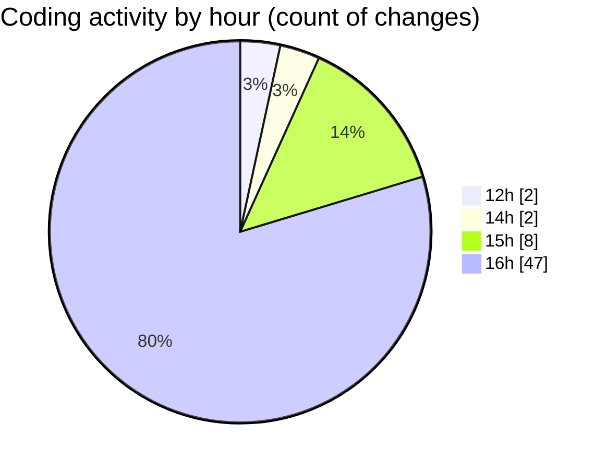

# nxtqube_webapp - Activity Summary 

## Overall Statistics

| Stat                   | Value                                                             |
| ---------------------- | ----------------------------------------------------------------- |
| **Lines Added** (➕)   | 4732                                          |
| **Lines Removed** (➖) | 1522                                        |
| **Net Change** (↕)    | 3210                |
| **Active Time** (⌚)   | 59 minutes |

## Modified Files
- **Map.jsx** (+3011, -1521)
- **scriptM.py** (+126, -0)
- **scriptLA.py** (+105, -1)
- **MapOld.jsx** (+1490, -0)

## Visualizations

### By File Type (Lines Changed)

### By Hour (Estimated Activity Count)

> **Last Updated:** 20/05/2025, 16:39:51