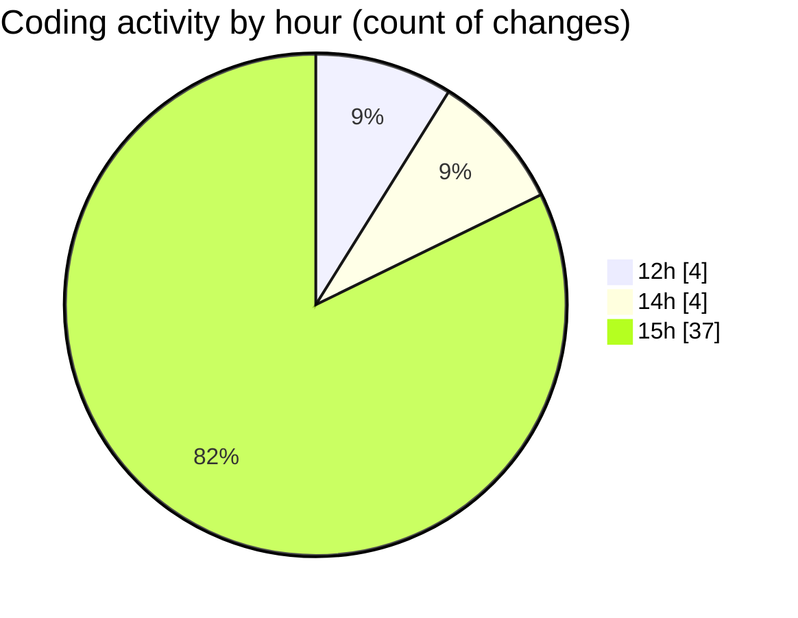

# nxtqube_webapp - Activity Summary 

## Overall Statistics

| Stat                   | Value                                                             |
| ---------------------- | ----------------------------------------------------------------- |
| **Lines Added** (➕)   | 4213                                          |
| **Lines Removed** (➖) | 913                                        |
| **Net Change** (↕)    | 3300                |
| **Active Time** (⌚)   | 59 minutes |

## Modified Files
- **dataProcessor.js** (+212, -1)
- **dockLocation.controller.js** (+78, -0)
- **dockLocation.route.js** (+12, -0)
- **ExistingMission.jsx** (+1664, -896)
- **DockCard.jsx** (+613, -1)
- **Map.jsx** (+1538, -15)
- **locationService.js** (+96, -0)

## Visualizations

### By File Type (Lines Changed)

### By Hour (Estimated Activity Count)

> **Last Updated:** 21/05/2025, 15:28:01