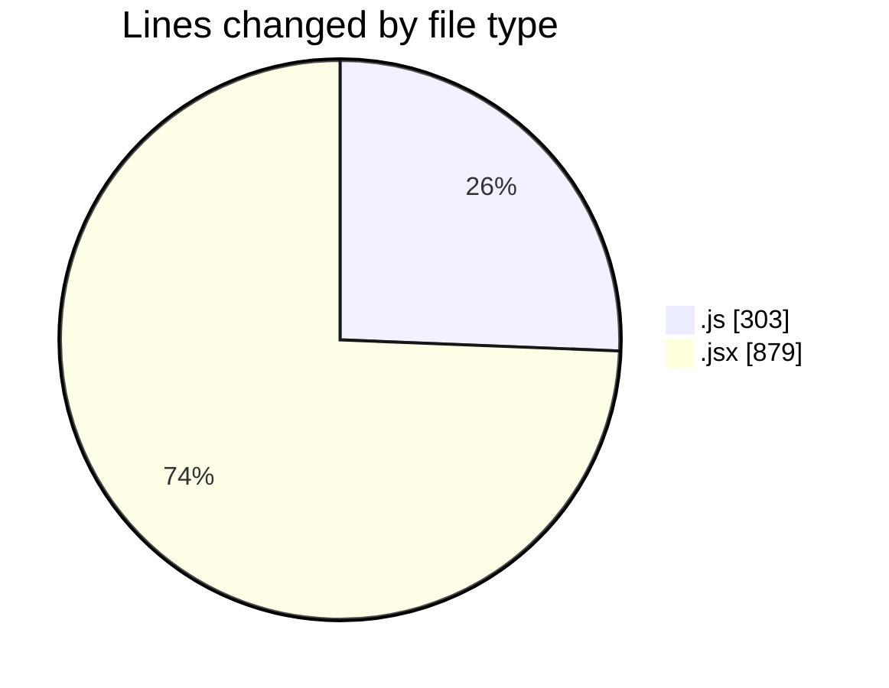
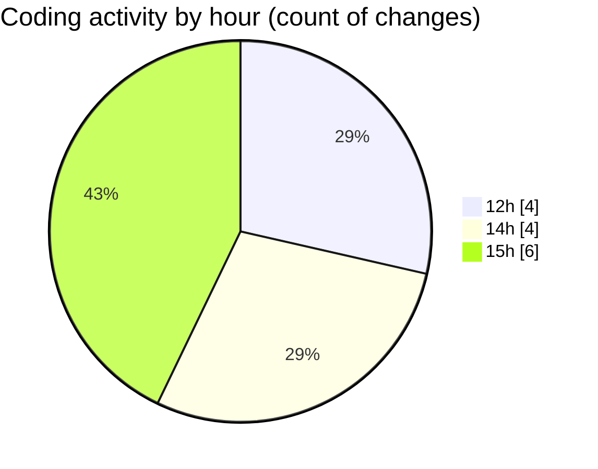

# nxtqube_webapp - Activity Summary 

## Overall Statistics

| Stat                   | Value                                                             |
| ---------------------- | ----------------------------------------------------------------- |
| **Lines Added** (➕)   | 1114                                          |
| **Lines Removed** (➖) | 68                                        |
| **Net Change** (↕)    | 1046                |
| **Active Time** (⌚)   | 11 minutes |

## Modified Files
- **dataProcessor.js** (+212, -1)
- **dockLocation.controller.js** (+78, -0)
- **dockLocation.route.js** (+12, -0)
- **ExistingMission.jsx** (+812, -67)

## Visualizations

### By File Type (Lines Changed)

### By Hour (Estimated Activity Count)

> **Last Updated:** 21/05/2025, 15:03:01