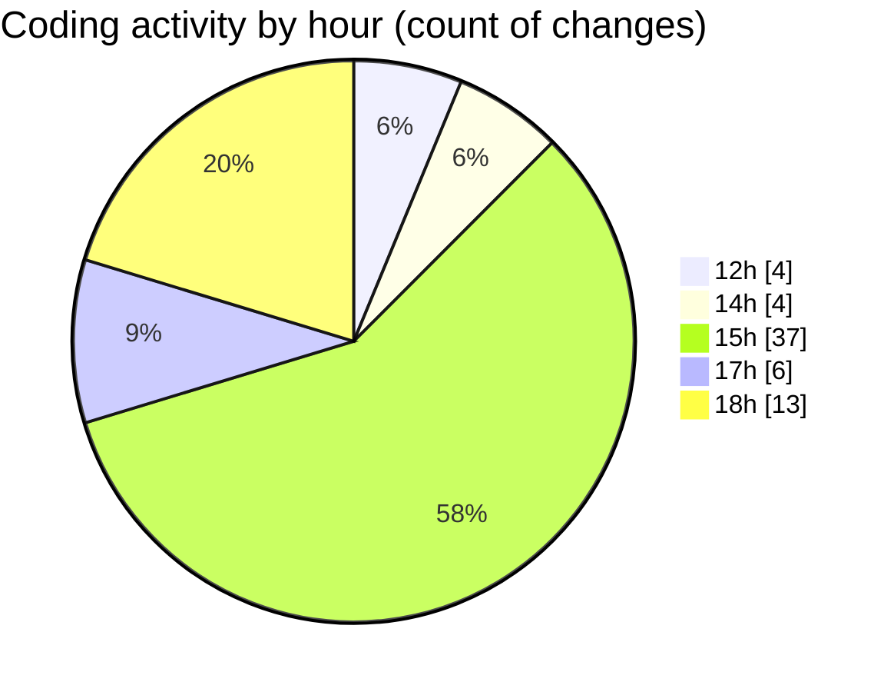

# nxtqube_webapp - Activity Summary 

## Overall Statistics

| Stat                   | Value                                                             |
| ---------------------- | ----------------------------------------------------------------- |
| **Lines Added** (➕)   | 4985                                          |
| **Lines Removed** (➖) | 969                                        |
| **Net Change** (↕)    | 4016                |
| **Active Time** (⌚)   | 78 minutes |

## Modified Files
- **dataProcessor.js** (+212, -1)
- **dockLocation.controller.js** (+78, -0)
- **dockLocation.route.js** (+12, -0)
- **ExistingMission.jsx** (+1664, -917)
- **DockCard.jsx** (+613, -1)
- **Map.jsx** (+1542, -15)
- **locationService.js** (+99, -4)
- **fetchHomeLocation.jsx** (+42, -10)
- **recenterMapToHome.js** (+42, -10)
- **DroneControl.jsx** (+681, -11)

## Visualizations

### By File Type (Lines Changed)

### By Hour (Estimated Activity Count)

> **Last Updated:** 21/05/2025, 18:40:10