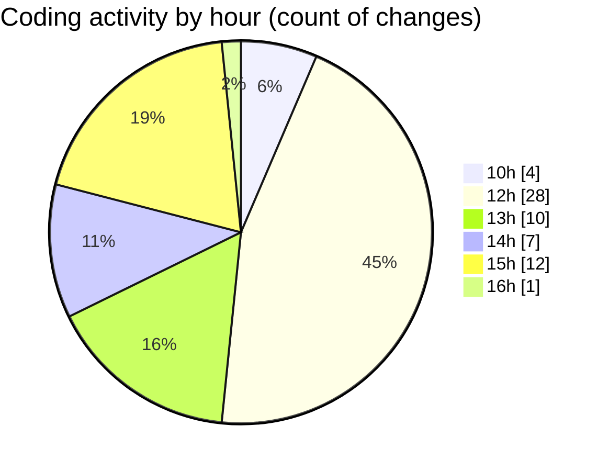

# nxtqube_webapp - Activity Summary 

## Overall Statistics

| Stat                   | Value                                                             |
| ---------------------- | ----------------------------------------------------------------- |
| **Lines Added** (➕)   | 3069                                          |
| **Lines Removed** (➖) | 381                                        |
| **Net Change** (↕)    | 2688                |
| **Active Time** (⌚)   | 73 minutes |

## Modified Files
- **Map.jsx** (+1870, -290)
- **droneLocation.js** (+212, -62)
- **ExistingMission.jsx** (+776, -29)
- **dataProcessor.js** (+211, -0)

## Visualizations

### By File Type (Lines Changed)

### By Hour (Estimated Activity Count)

> **Last Updated:** 22/05/2025, 16:08:25