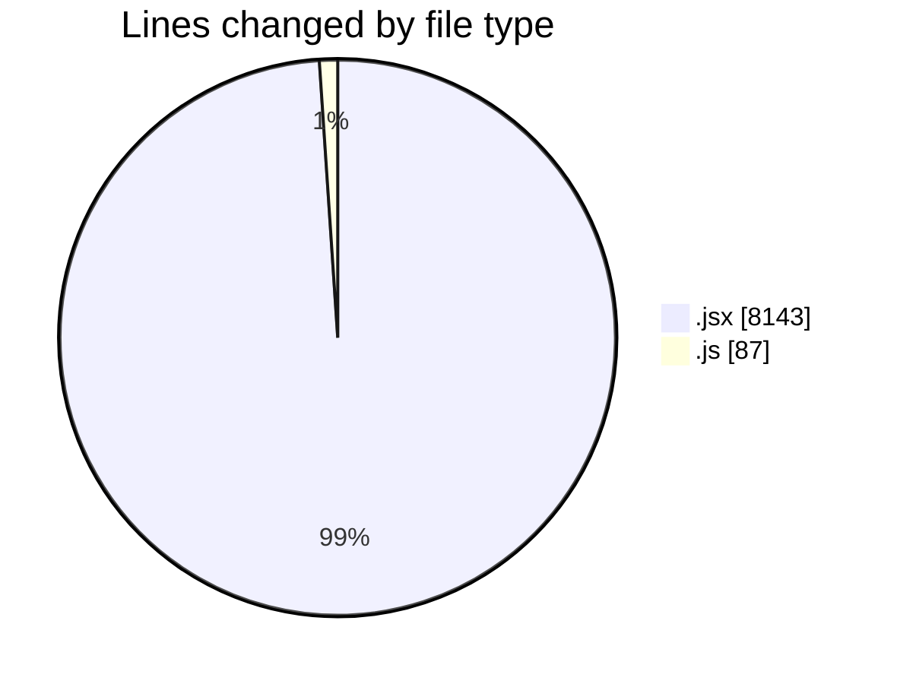
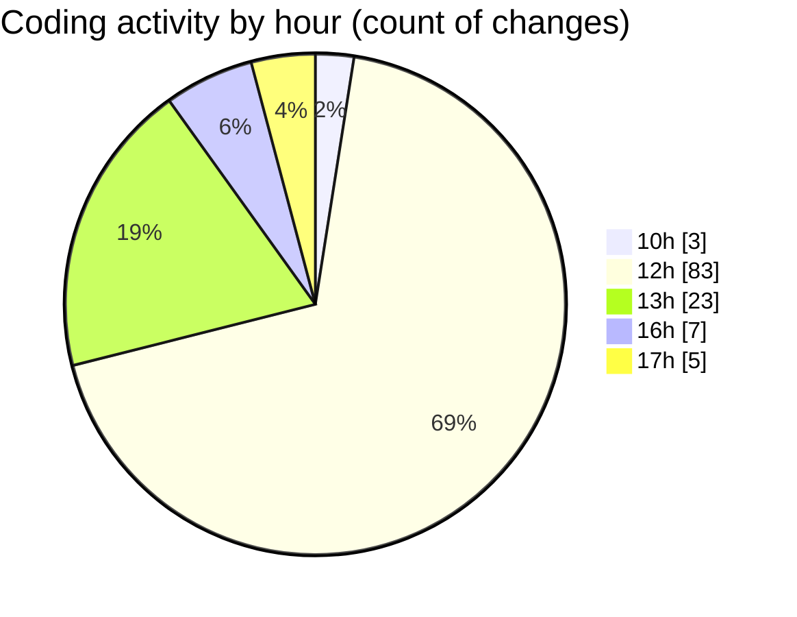

# nxtqube_webapp - Activity Summary 

## Overall Statistics

| Stat                   | Value                                                             |
| ---------------------- | ----------------------------------------------------------------- |
| **Lines Added** (➕)   | 4705                                          |
| **Lines Removed** (➖) | 3525                                        |
| **Net Change** (↕)    | 1180                |
| **Active Time** (⌚)   | 141 minutes |

## Modified Files
- **ExistingMission.jsx** (+747, -2)
- **Map.jsx** (+3413, -3496)
- **Mission.jsx** (+18, -26)
- **ManageMission.jsx** (+210, -1)
- **HandleAddWaypointOnclick.js** (+87, -0)
- **TotalTime.jsx** (+230, -0)

## Visualizations

### By File Type (Lines Changed)

### By Hour (Estimated Activity Count)

> **Last Updated:** 27/05/2025, 17:39:28