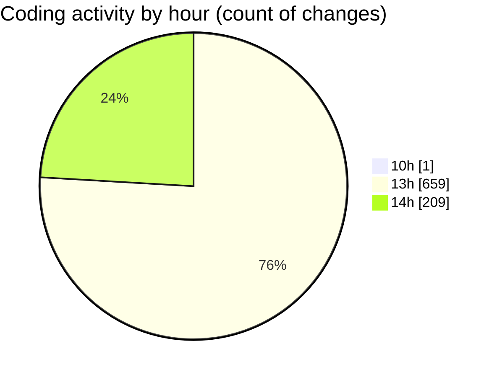

# nxtqube_webapp - Activity Summary 

## Overall Statistics

| Stat                   | Value                                                             |
| ---------------------- | ----------------------------------------------------------------- |
| **Lines Added** (➕)   | 66337                                          |
| **Lines Removed** (➖) | 1                                        |
| **Net Change** (↕)    | 66336                |
| **Active Time** (⌚)   | 866 minutes |

## Modified Files
- **mqttSubscriber.js** (+0, -1)
- **1_ARGOS_DATA_226.log** (+32964, -0)
- **1_ARGOS_DATA_229.log** (+33373, -0)

## Visualizations

### By File Type (Lines Changed)

### By Hour (Estimated Activity Count)

> **Last Updated:** 28/05/2025, 14:04:59