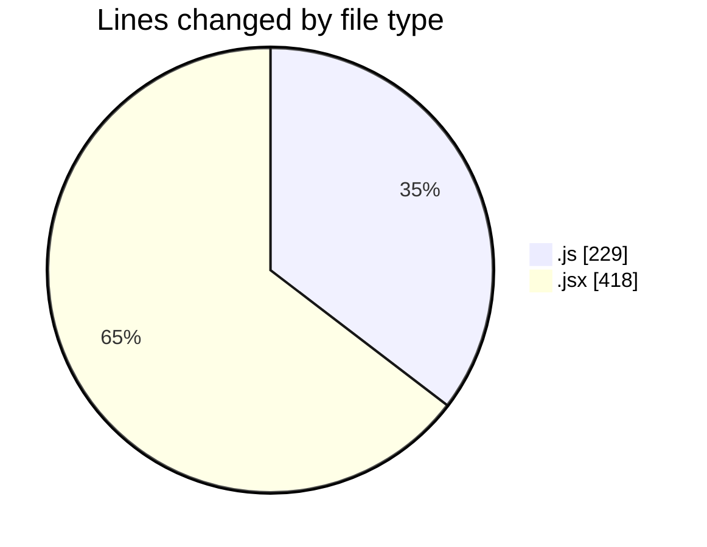
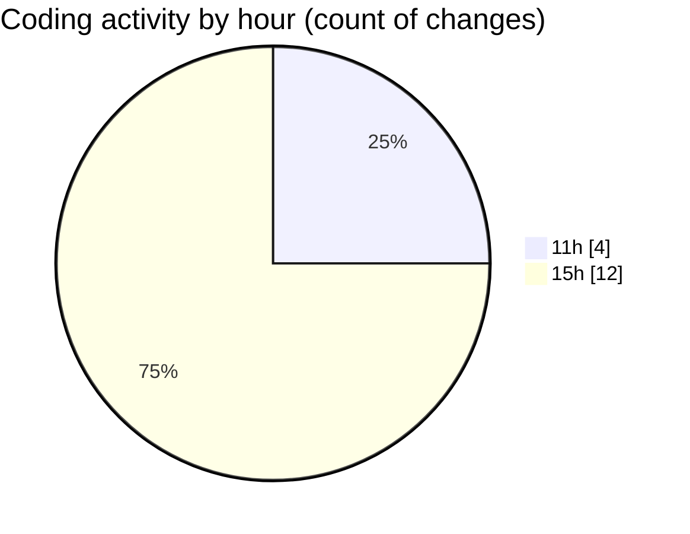

# nxtqube_webapp - Activity Summary 

## Overall Statistics

| Stat                   | Value                                                             |
| ---------------------- | ----------------------------------------------------------------- |
| **Lines Added** (➕)   | 625                                          |
| **Lines Removed** (➖) | 22                                        |
| **Net Change** (↕)    | 603                |
| **Active Time** (⌚)   | 23 minutes |

## Modified Files
- **locationService.js** (+95, -2)
- **setSafeLocation.jsx** (+224, -0)
- **FetchHomeLocation.jsx** (+194, -0)
- **failsafe.model.js** (+57, -17)
- **droneFailsafe.model.js** (+55, -3)

## Visualizations

### By File Type (Lines Changed)

### By Hour (Estimated Activity Count)

> **Last Updated:** 29/05/2025, 15:24:02