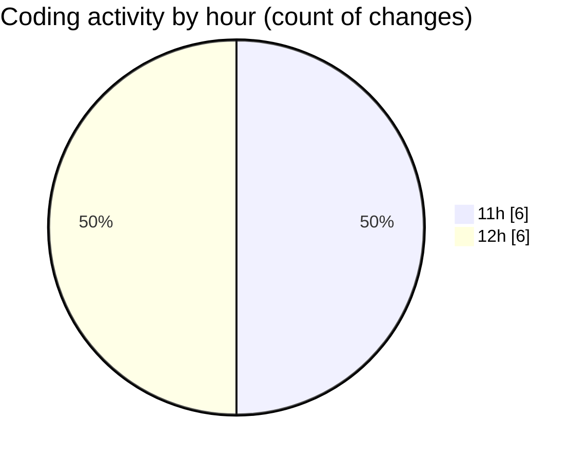

# nxtqube_webapp - Activity Summary 

## Overall Statistics

| Stat                   | Value                                                             |
| ---------------------- | ----------------------------------------------------------------- |
| **Lines Added** (➕)   | 499                                          |
| **Lines Removed** (➖) | 8                                        |
| **Net Change** (↕)    | 491                |
| **Active Time** (⌚)   | 9 minutes |

## Modified Files
- **droneFailsafeDefaluts.model.js** (+52, -0)
- **droneControl.model.js** (+98, -8)
- **droneControl.controller.js** (+349, -0)

## Visualizations

### By File Type (Lines Changed)

### By Hour (Estimated Activity Count)

> **Last Updated:** 30/05/2025, 12:47:03