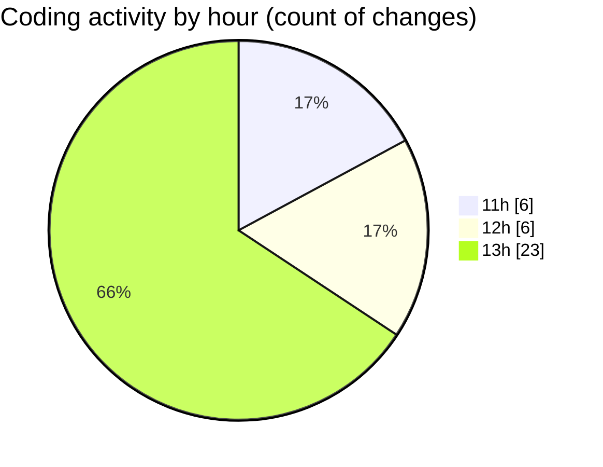

# nxtqube_webapp - Activity Summary 

## Overall Statistics

| Stat                   | Value                                                             |
| ---------------------- | ----------------------------------------------------------------- |
| **Lines Added** (➕)   | 642                                          |
| **Lines Removed** (➖) | 238                                        |
| **Net Change** (↕)    | 404                |
| **Active Time** (⌚)   | 34 minutes |

## Modified Files
- **droneFailsafeDefaluts.model.js** (+54, -0)
- **droneControl.model.js** (+108, -8)
- **droneControl.controller.js** (+415, -230)
- **droneFailsafe.model.js** (+54, -0)
- **droneControl.route.js** (+11, -0)

## Visualizations

### By File Type (Lines Changed)

### By Hour (Estimated Activity Count)

> **Last Updated:** 30/05/2025, 13:44:11