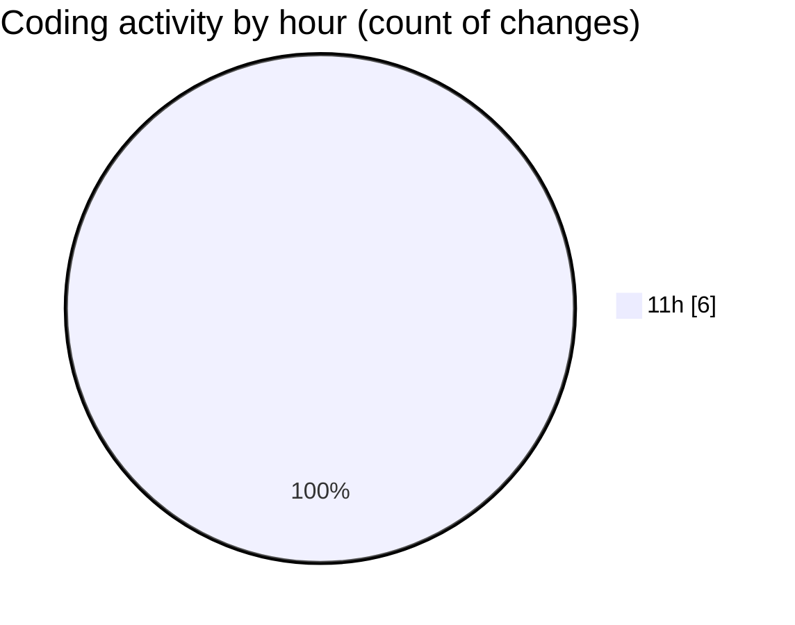

# nxtqube_webapp - Activity Summary 

## Overall Statistics

| Stat                   | Value                                                             |
| ---------------------- | ----------------------------------------------------------------- |
| **Lines Added** (➕)   | 145                                          |
| **Lines Removed** (➖) | 1                                        |
| **Net Change** (↕)    | 144                |
| **Active Time** (⌚)   | 4 minutes |

## Modified Files
- **droneFailsafeDefaluts.model.js** (+52, -0)
- **droneControl.model.js** (+93, -1)

## Visualizations

### By File Type (Lines Changed)

### By Hour (Estimated Activity Count)

> **Last Updated:** 30/05/2025, 12:00:24