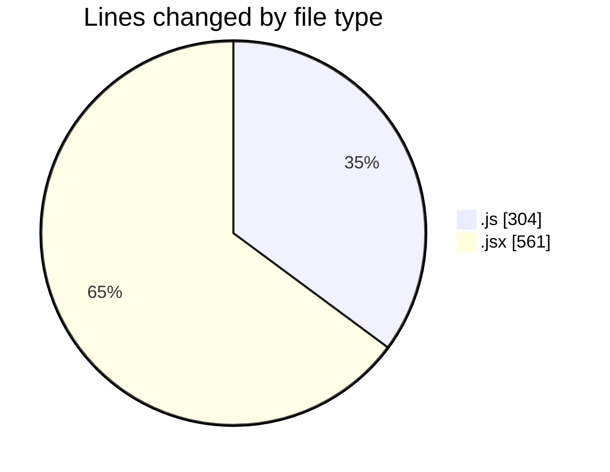
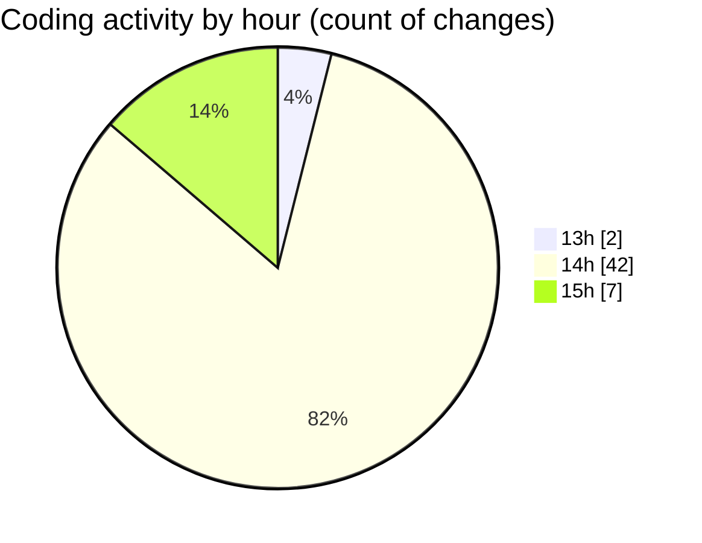

# nxtqube_webapp - Activity Summary 

## Overall Statistics

| Stat                   | Value                                                             |
| ---------------------- | ----------------------------------------------------------------- |
| **Lines Added** (➕)   | 785                                          |
| **Lines Removed** (➖) | 80                                        |
| **Net Change** (↕)    | 705                |
| **Active Time** (⌚)   | 58 minutes |

## Modified Files
- **drone.utils.js** (+38, -1)
- **user.controller.js** (+148, -0)
- **droneControl&FailSafeDefaults.utils.js** (+52, -24)
- **LoginPage.jsx** (+506, -55)
- **droneControlDefaults.js** (+41, -0)

## Visualizations

### By File Type (Lines Changed)

### By Hour (Estimated Activity Count)

> **Last Updated:** 31/05/2025, 15:03:51