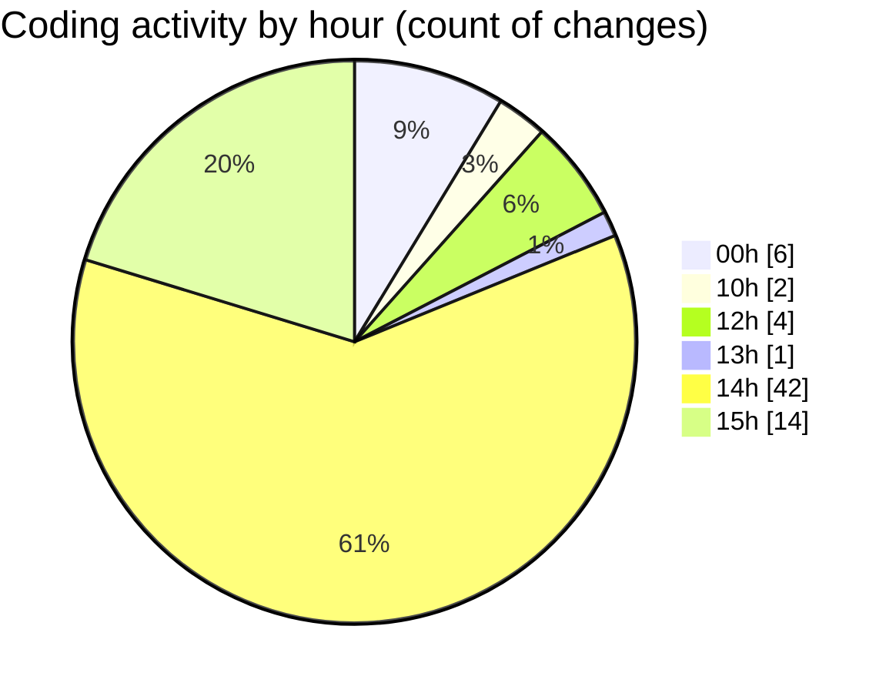

# nxtqube_webapp - Activity Summary 

## Overall Statistics

| Stat                   | Value                                                             |
| ---------------------- | ----------------------------------------------------------------- |
| **Lines Added** (➕)   | 2025                                          |
| **Lines Removed** (➖) | 661                                        |
| **Net Change** (↕)    | 1364                |
| **Active Time** (⌚)   | 91 minutes |

## Modified Files
- **DroneControl.jsx** (+870, -11)
- **App.jsx** (+524, -212)
- **generalSettings.js** (+114, -72)
- **generalSetting.controller.js** (+439, -360)
- **generalSetting.route.js** (+20, -6)
- **routes.js** (+58, -0)

## Visualizations

### By File Type (Lines Changed)

### By Hour (Estimated Activity Count)

> **Last Updated:** 04/06/2025, 15:50:57