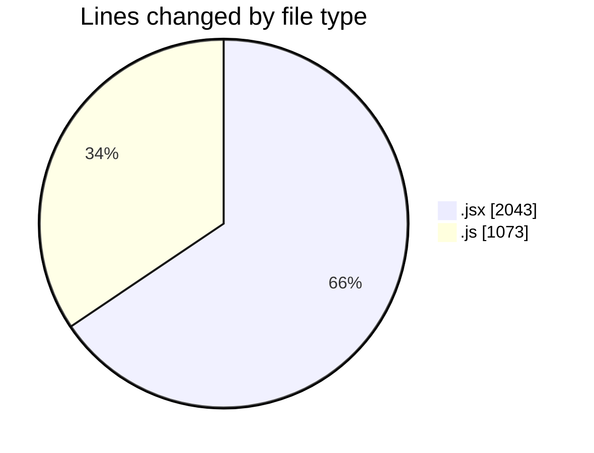
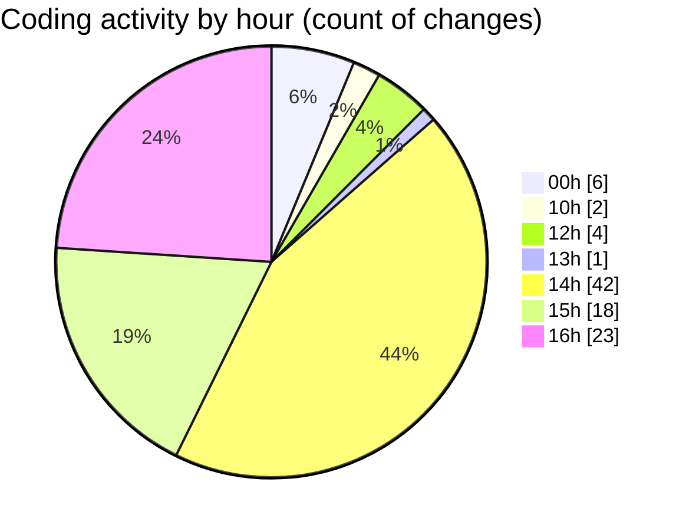

# nxtqube_webapp - Activity Summary 

## Overall Statistics

| Stat                   | Value                                                             |
| ---------------------- | ----------------------------------------------------------------- |
| **Lines Added** (➕)   | 2439                                          |
| **Lines Removed** (➖) | 677                                        |
| **Net Change** (↕)    | 1762                |
| **Active Time** (⌚)   | 132 minutes |

## Modified Files
- **DroneControl.jsx** (+870, -15)
- **App.jsx** (+524, -213)
- **generalSettings.js** (+114, -72)
- **generalSetting.controller.js** (+439, -360)
- **generalSetting.route.js** (+22, -8)
- **routes.js** (+58, -0)
- **GeneralSettings.jsx** (+412, -9)

## Visualizations

### By File Type (Lines Changed)

### By Hour (Estimated Activity Count)

> **Last Updated:** 04/06/2025, 16:52:04