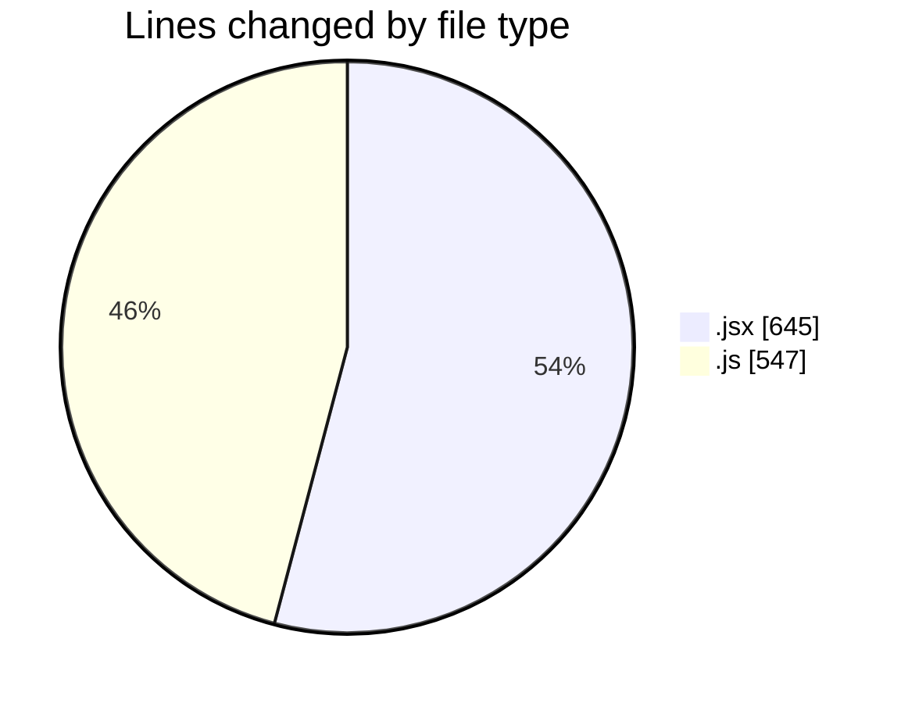
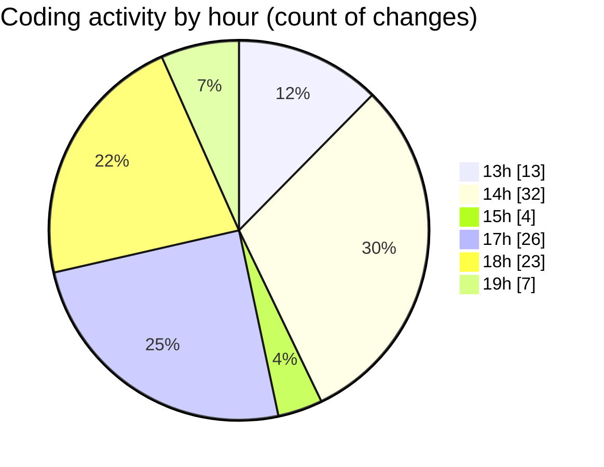

# nxtqube_webapp - Activity Summary 

## Overall Statistics

| Stat                   | Value                                                             |
| ---------------------- | ----------------------------------------------------------------- |
| **Lines Added** (➕)   | 827                                          |
| **Lines Removed** (➖) | 365                                        |
| **Net Change** (↕)    | 462                |
| **Active Time** (⌚)   | 120 minutes |

## Modified Files
- **SettingsContent.jsx** (+0, -37)
- **GeneralSettings.jsx** (+143, -108)
- **help.model.js** (+124, -74)
- **ticket_replies.model.js** (+70, -24)
- **helpdesk_ticket.controller.js** (+119, -77)
- **helpdesk_ticket.route.js** (+30, -21)
- **routes.js** (+4, -4)
- **help.jsx** (+337, -20)

## Visualizations

### By File Type (Lines Changed)

### By Hour (Estimated Activity Count)

> **Last Updated:** 05/06/2025, 19:19:37