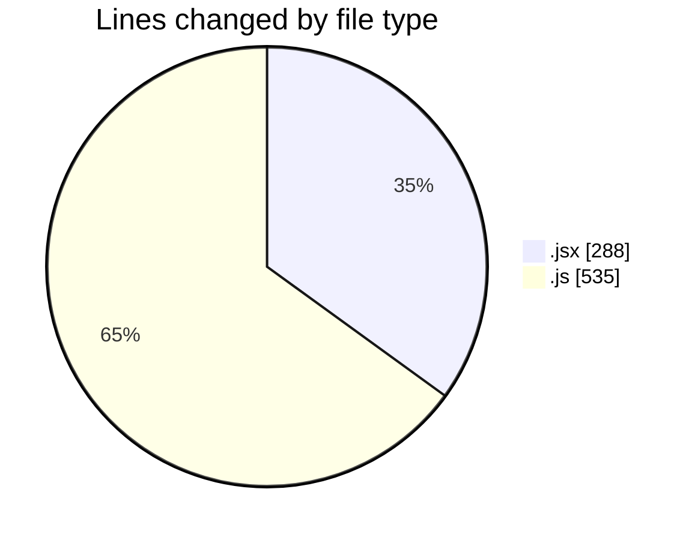
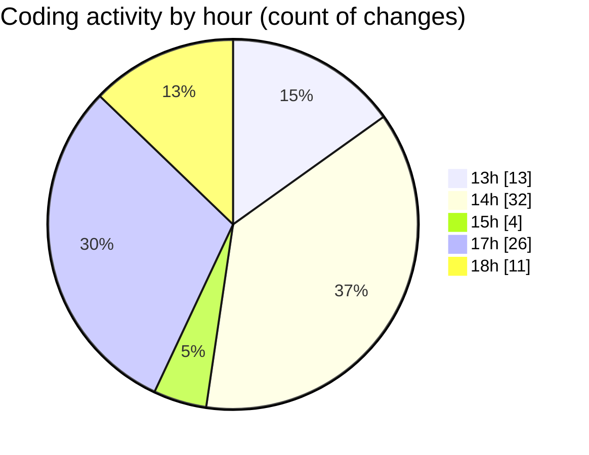

# nxtqube_webapp - Activity Summary 

## Overall Statistics

| Stat                   | Value                                                             |
| ---------------------- | ----------------------------------------------------------------- |
| **Lines Added** (➕)   | 486                                          |
| **Lines Removed** (➖) | 337                                        |
| **Net Change** (↕)    | 149                |
| **Active Time** (⌚)   | 102 minutes |

## Modified Files
- **SettingsContent.jsx** (+0, -37)
- **GeneralSettings.jsx** (+143, -108)
- **help.model.js** (+124, -74)
- **ticket_replies.model.js** (+70, -24)
- **helpdesk_ticket.controller.js** (+119, -77)
- **helpdesk_ticket.route.js** (+30, -17)

## Visualizations

### By File Type (Lines Changed)

### By Hour (Estimated Activity Count)

> **Last Updated:** 05/06/2025, 18:02:28