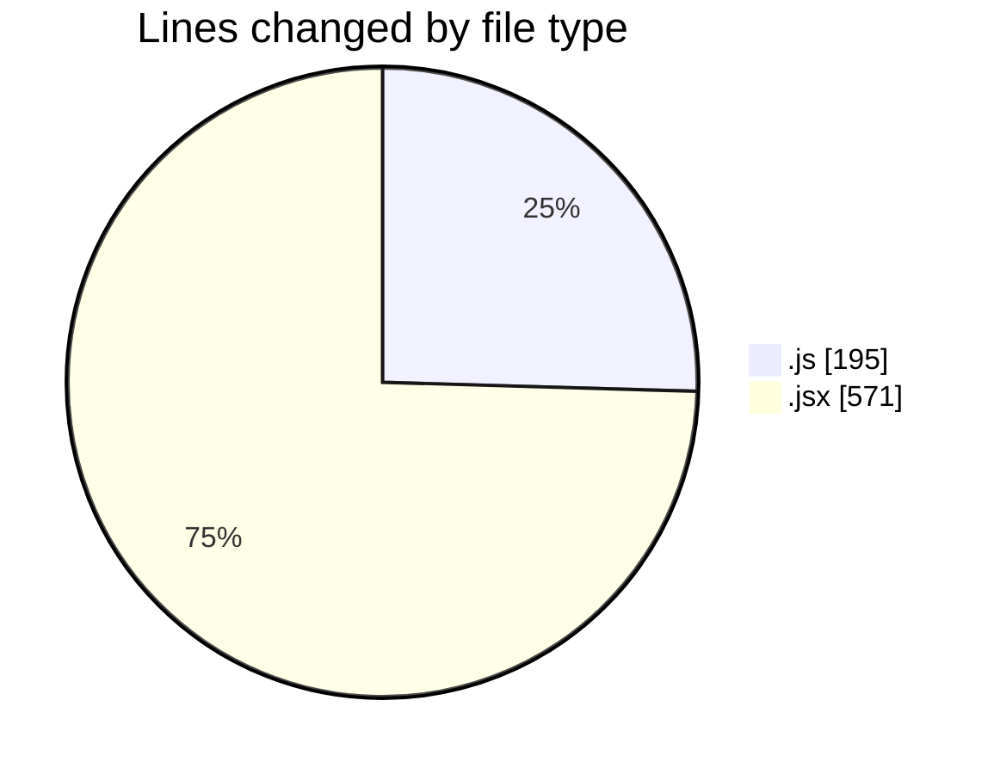
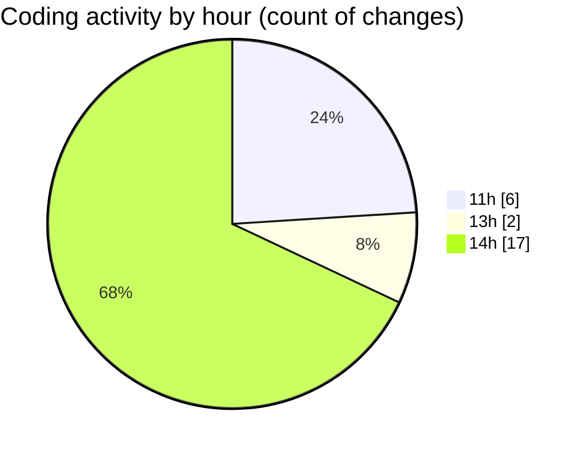

# nxtqube_webapp - Activity Summary 

## Overall Statistics

| Stat                   | Value                                                             |
| ---------------------- | ----------------------------------------------------------------- |
| **Lines Added** (➕)   | 711                                          |
| **Lines Removed** (➖) | 55                                        |
| **Net Change** (↕)    | 656                |
| **Active Time** (⌚)   | 29 minutes |

## Modified Files
- **helpdesk_ticket.controller.js** (+122, -5)
- **help.jsx** (+523, -48)
- **helpdesk_ticket.route.js** (+16, -2)
- **help.model.js** (+50, -0)

## Visualizations

### By File Type (Lines Changed)

### By Hour (Estimated Activity Count)

> **Last Updated:** 07/06/2025, 14:38:11