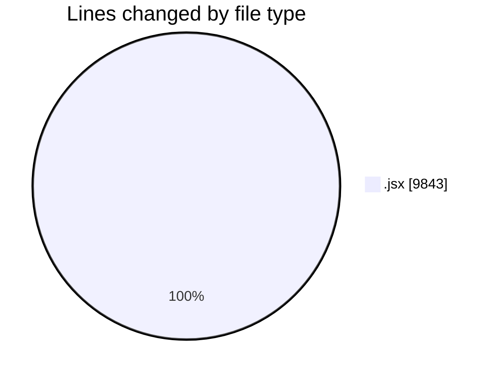
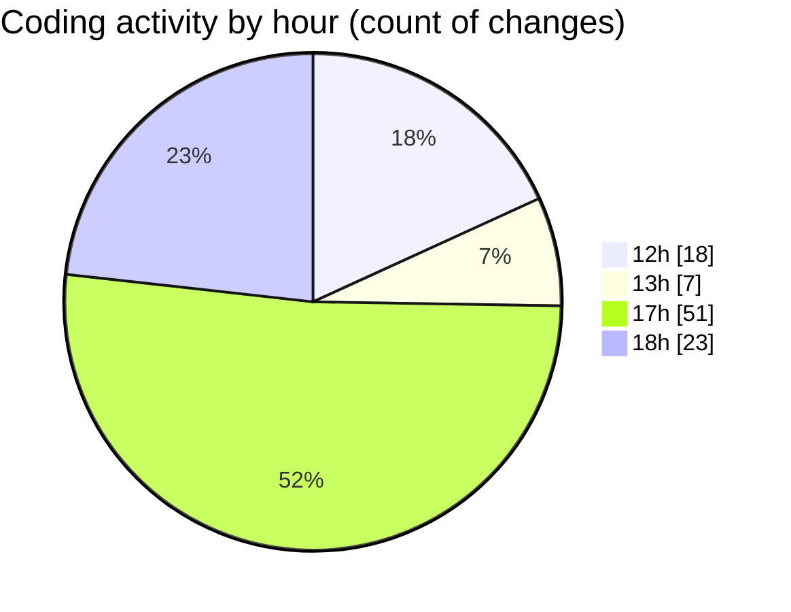

# nxtqube_webapp - Activity Summary 

## Overall Statistics

| Stat                   | Value                                                             |
| ---------------------- | ----------------------------------------------------------------- |
| **Lines Added** (➕)   | 7166                                          |
| **Lines Removed** (➖) | 2677                                        |
| **Net Change** (↕)    | 4489                |
| **Active Time** (⌚)   | 110 minutes |

## Modified Files
- **help.jsx** (+590, -118)
- **helpdesk.jsx** (+473, -359)
- **AllRoutes.jsx** (+131, -6)
- **General.jsx** (+55, -0)
- **SettingsContent.jsx** (+122, -0)
- **Map.jsx** (+3926, -2194)
- **MapOld.jsx** (+1692, -0)
- **MapPlacesApi.jsx** (+177, -0)

## Visualizations

### By File Type (Lines Changed)

### By Hour (Estimated Activity Count)

> **Last Updated:** 14/06/2025, 18:16:07