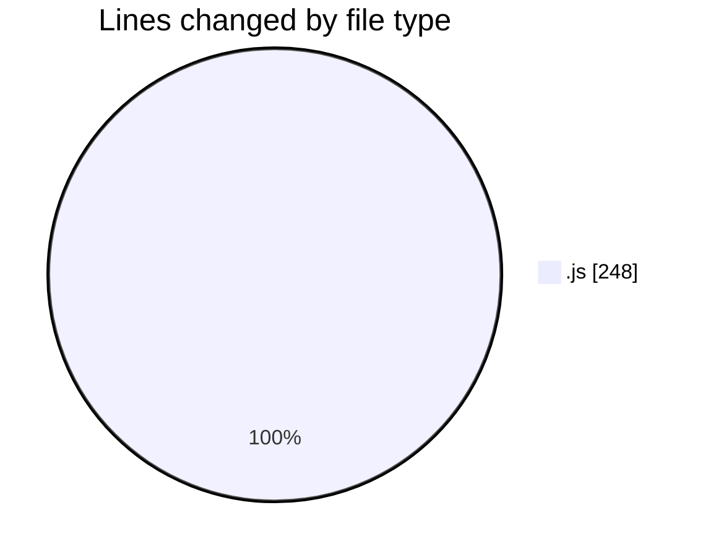
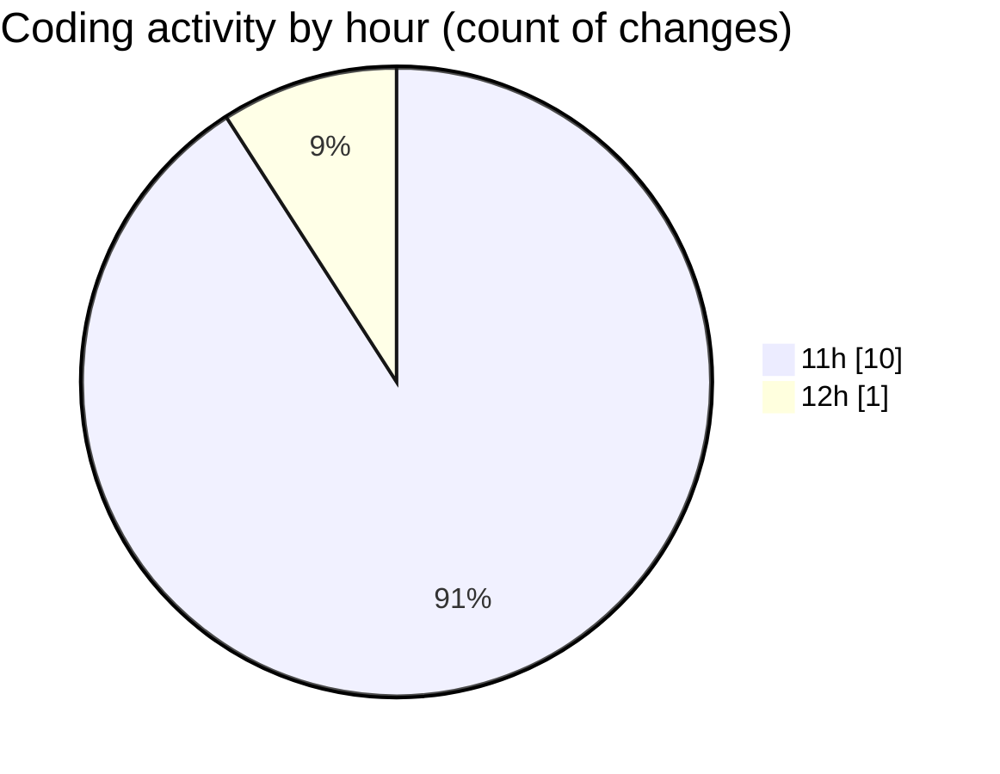

# nxtqube_webapp - Activity Summary 

## Overall Statistics

| Stat                   | Value                                                             |
| ---------------------- | ----------------------------------------------------------------- |
| **Lines Added** (➕)   | 247                                          |
| **Lines Removed** (➖) | 1                                        |
| **Net Change** (↕)    | 246                |
| **Active Time** (⌚)   | 10 minutes |

## Modified Files
- **model-drone.model.js** (+38, -0)
- **drone.model.js** (+92, -0)
- **drone-defaults.model.js** (+39, -0)
- **droneControlNxtqubeModel-Defaults.model.js** (+39, -0)
- **droneControlUserModelDefaults.model.js** (+39, -0)
- **dataProcessor.js** (+0, -1)

## Visualizations

### By File Type (Lines Changed)

### By Hour (Estimated Activity Count)

> **Last Updated:** 19/06/2025, 12:34:17