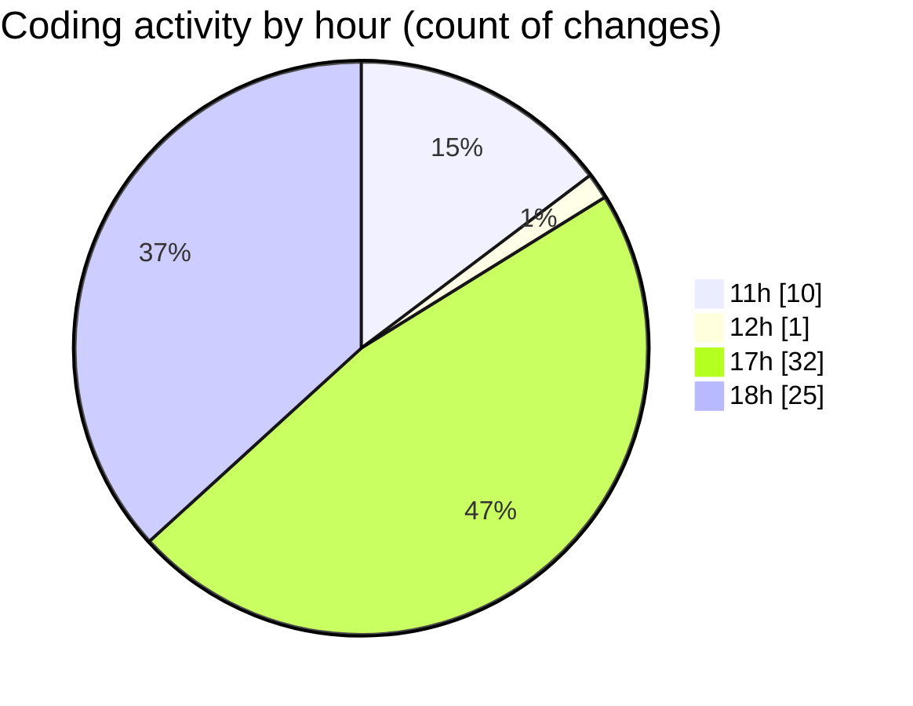

# nxtqube_webapp - Activity Summary 

## Overall Statistics

| Stat                   | Value                                                             |
| ---------------------- | ----------------------------------------------------------------- |
| **Lines Added** (➕)   | 611                                          |
| **Lines Removed** (➖) | 148                                        |
| **Net Change** (↕)    | 463                |
| **Active Time** (⌚)   | 82 minutes |

## Modified Files
- **model-drone.model.js** (+38, -0)
- **drone.model.js** (+174, -57)
- **drone-defaults.model.js** (+39, -0)
- **droneControlNxtqubeModel-Defaults.model.js** (+39, -0)
- **droneControlUserModelDefaults.model.js** (+39, -0)
- **dataProcessor.js** (+0, -1)
- **ModelNxtqubeDrones.model.js** (+116, -45)
- **ModelsNxtqubeDrone.controller.js** (+93, -44)
- **ModelsNxtqubeDrone.route.js** (+10, -1)
- **routes.js** (+63, -0)

## Visualizations

### By File Type (Lines Changed)

### By Hour (Estimated Activity Count)

> **Last Updated:** 19/06/2025, 18:59:41